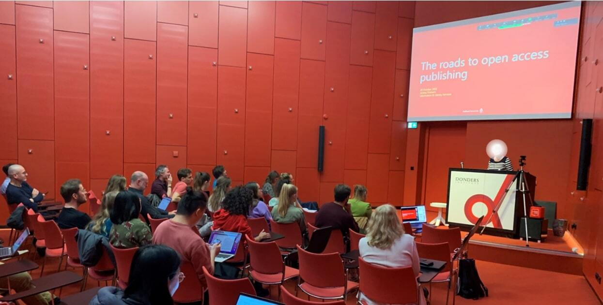

```{r setup, include=FALSE}
knitr::opts_chunk$set(echo = FALSE)

# Learn more about creating blogs with Distill at:
# https://rstudio.github.io/distill/blog.html

```


Open Science is the hip thing right now, confirmed our first speaker of the day, *Dirk van Gorp*. The Donders Session: Open Science Day certainly reinvigorated my enthusiasm for open science – and not just because it’s where all the cool kids hang out.

We (Fleur Zeldenrust, Sam Parsons, Rogier Kievit, and Laura de Nooij) wanted to showcase a wide range of useful tools and researchers’ experiences in Open Science. Seven speakers joined us in person, and remotely, across three broad sessions.

In the spirit of Open Science, recordings^[The recordings of the presentations are not available at the moment, but will be added soon.] of the presentations and the slides are available [here](https://osf.io/3tnh6/). The talks speak for themselves, but there were some key take-home messages and threads that ran neatly through the day.


```{r, layout = "l-body-ouset", fig.width=3, echo=FALSE}

knitr::include_graphics("open-science-Dirk_Sam.jpg")

```


**Session 1: “What is open science?”**

There isn’t a clear answer, with “almost as many definitions as universities” ([**Dirk van Gorp**](https://www.ru.nl/personen/gorp-d-van)). It was enlightening to hear about many initiatives happening at the Radboud – some behind-the-scenes, and others much more visible. The current policy initiatives look to help researchers make their work more Findable and Accessible. Dirk asked the audience who was familiar with the central Open Access policy, and only four hands were raised. This became a running theme of the event, there are many more impressive Open Science-related initiatives out there to learn about and benefit from. Making these initiatives and resources more visible is an important goal.


**Session 2: Our speakers introduced a bunch of useful tools**

[**Gonny Kremers**](https://www.ru.nl/personen/kremers-a) covered how to publish your work openly and the routes to open access, including Green (self-archiving), Gold (journal open access), and hybrid. Gonny shared important information for all Netherlands based researchers about [Plan S](https://www.coalition-s.org/plan_s_principles/) and the [Taverne Amendment](https://www.openaccess.nl/en/in-the-netherlands/you-share-we-take-care). Understanding each is integral for all researchers funded by organisations that have signed Plan S, including NWO, ZonMw, and European Commission.

[**Padraig Gleeson**](https://scholar.google.com/citations?user=ah9NSNkAAAAJ&hl=fr) shared [Open Source Brain](https://www.opensourcebrain.org/), a platform for sharing and developing computational models of neural systems in an open and collaborative way. Open Neuroscience data, open models, and simulation tools are powerful, but to maximise their use, we need the computing infrastructure – Open Source Brain provides this. As Padraig said, and was echoed by almost every other speaker, “we want to lower the barrier for participation in science”.

[**Caspar van Lissa**](https://www.tilburguniversity.edu/nl/medewerkers/c-j-vanlissa) introduced a [Workflow for Open Reproducible Code in Science](https://content.iospress.com/articles/data-science/ds210031) (WORCS), a tool to “lower the barrier of entry” into reproducible science. WORCS introduces an open and reproducible research workflow from the beginning of a project. It is built into an [R package with github integration](https://github.com/cjvanlissa/worcs) – which not only helps reproducibility but adds version control too. This has the benefit of making all of the tasks we usually remember at the last minute (share code, prepare data to share) easy and part of the natural workflow of a project.


```{r, layout = "l-body-ouset", fig.width=3, echo=FALSE}



```


**Session 3: Experiences of being an open scientist**

[**Emma Henderson**](https://emmalhenderson.com/) shared her experience of doing only [Registered Reports](https://www.cos.io/initiatives/registered-reports). For a Registered Report, authors submit a Stage 1 manuscript (introduction, methods, data analysis plan) to a journal for review. The manuscript is reviewed and accepted in-principle, before data are collected. Then, after the data are collected and analyses ran, the manuscript is accepted regardless of the results. This exciting format removes many forms of bias from the publication process, chiefly whether manuscripts are accepted based on significant results. The most common worry for students and their supervisors, interested in registered reports, is time. Emma’s response was clearly “I can make this work” – she completed three for her PhD Thesis. More than that, the review times Emma shared made many of us jealous compared to “traditional” peer review timelines.

[**Stephanie Forkel**](https://www.stephanieforkel.com/) shared a smorgasbord of principles and practices of Open Science she uses with her collaborators: Use open tools (e.g. [human connectome project](http://www.humanconnectomeproject.org/), FSL, python), Share your data (e.g. [neurovault](https://neurovault.org/), [github](https://github.com/), [thingiverse](https://www.thingiverse.com/stephforkel/designs), and Stephanie’s [personal website](https://www.stephanieforkel.com/)), and make manuscripts open access (e.g. [medRxiv](https://www.medrxiv.org/), [bioRxiv](https://www.biorxiv.org/), [Research Square](https://www.researchsquare.com/researchers/overview?campaignid=12066272825&adgroupid=116383145196&creative=627717342606&matchtype=b&network=g&device=c&keyword=research%20square&gclid=CjwKCAiA68ebBhB-EiwALVC-NrVH5u5ufn_MONwN6Qm26x_4PcXP15eOAXNkrMOZgXwQshjfPrk6JBoCzm0QAvD_BwE), and more). In keeping with the spirit of the day, Stephanie discussed taking everyone else along and equitable access with the Neuroscience Alliance ([NEURAL](https://www.neurosciencealliance.org/)). To further discuss, engage, and communicate check out [@CNSeminars](https://www.clinicalneuroanatomyseminars.com/); there are journal clubs, journal special issues, interviews, neuroimaging tutorials, movies, debates, and more. There are so many ways to get involved and benefit from Open Science that it can be overwhelming. But, don’t feel like you have to do everything – just find something that works for you.

[**Coosje Veldkamp**](https://www.uu.nl/staff/CLSVeldkamp) is a project manager of the [YOUth Cohort Study](https://www.uu.nl/en/research/youth-cohort-study). The study itself is super impressive, following nearly 4000 Dutch children throughout development from pregnancy into early adulthood. Added to this, YOUth is a trailblazer in Open Science: the data are FAIR (Findable, Accessible, Interoperable, Reusable) to allow other researchers to use them, they are harmonising these data with other large scale projects (including the [Consortium on Individual Development](https://individualdevelopment.nl/)). Coosje shared the vital behind-the-scenes innovation that was required to build and maintain this huge open longitudinal cohort. Finally, Coosje shared the sobering note that funding for YOUth will soon run out, which prompted some audience reflection on the importance of longer-term investment in important open science infrastructure projects.  


**Discussion**: A day like this would not be complete without audience discussion and participation, and for our virtual attendees’ who doesn’t enjoy a break-out room discussion? Drawing on the Open Science as a buffet metaphor (Christina Bergman; read more here https://www.bps.org.uk/psychologist/bropenscience-broken-science) we discussed our own experiences, the kinds of open practices we want to try next, and the training we would need.

The practices that attendees were keen to adopt included sharing their data and code. We discussed sensitive data as a barrier to sharing, and that a viable work-around is to share simulated or synthetic data that share key statistical characteristics with the real data but are entirely anonymous. There were some fears around sharing code; what if my code is too messy? What if someone finds an error? In the end, we agreed that sharing messy code is still better - whether for others or for ourselves in the future - and at least if an error is found it can be corrected. Rounding off the discussion, we agreed that resources or training in code and data sharing would help alleviate some of these fears to help folk adopt more open practices. Perhaps for the next Donders Open Science day!


*Author: Sam Parsons*


