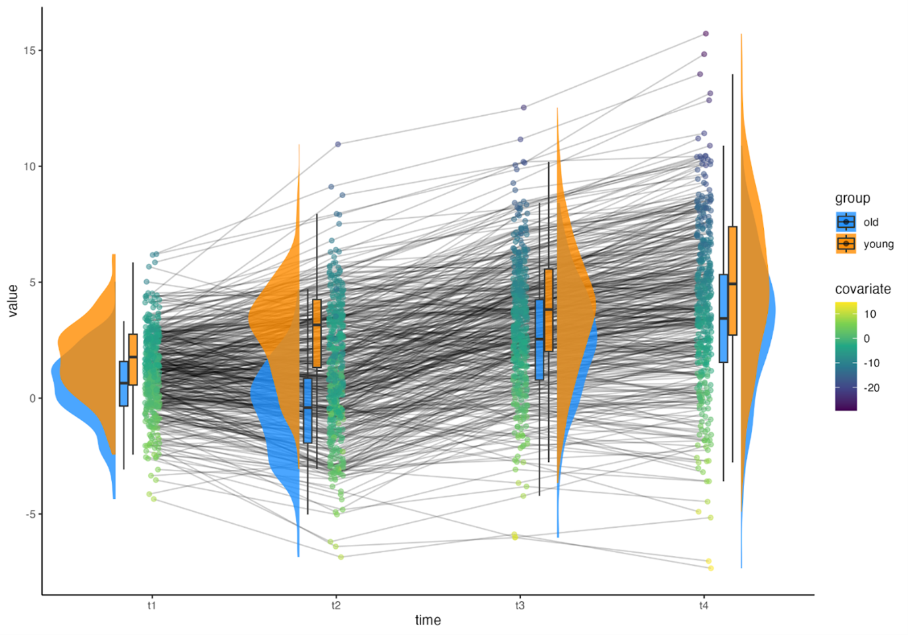
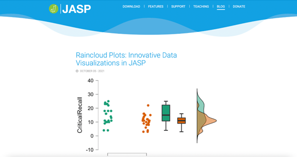

```{r setup, include=FALSE}
knitr::opts_chunk$set(echo = FALSE)


```


While the days are still short and dark, this post tries to spark some light by taking you along in our exciting open-science project: Raincloud plots! 

## The beginning - version 1.0

Somewhere during 2018, a fellow cognitive neuroscientist from Aarhus University, Micah Allen, was experimenting with a new type of data visualization on Twitter (the better Twitter times, Ed.). He was doing so in the R programming language and - crucially - data visualization is one of the many reasons to use R. 


```{r, out.width = "80%", fig.align = 'center', fig.cap="For the historical record, Jon Roiser coined the term ‘raincloud plots’."}
knitr::include_graphics("fig1.png")
```

After some ‘90 degrees’ rotating and ‘name-coining’, Raincloud Plots were born after which Micah wrote a blogpost on his website (https://neuroconscience.wordpress.com/2018/03/15/introducing-raincloud-plots/).
Shortly after, more people started to get involved such as Davide Poggialli who replicated it in Python, Tom Rhys Marshall recreated these in Matlab, and Kirstie Whitaker who wrapped the various codebases into a Jupyter notebook. 

### From Tweets to Papers 

The first instance of the Raincloud plots project took solely place in Twitter DMs which eventually ended up in writing a peer-reviewed paper, or more specifically a ‘software tool article’ that was published in Wellcome Open Research. After a little more than a year, we submitted a revised version of the paper and incorporated the most requested feature, a fully operational ‘raincloudplots’ R-package (https://github.com/jorvlan/raincloudplots). 

### Upgrade to version 2.0

In 2021, the Dutch research council (NWO) announced the launch of their inaugural Open Science Fund. NWO set up the Open Science Fund as a way to recognise and reward open science practices by supporting projects by researchers who are (or want to be) frontrunners in this movement. Part of the assessment, therefore, included applicants’ open science track record, which counted for 10% of the assessment. Team members Rogier and Jordy applied and raincloudplots were selected. One cool feature of this funding round is that all proposals and review comments were, in principle, made publicly available, showing how Open Science can also be part of the funding cycle! https://www.nwo.nl/en/news/open-science-fund-project-proposals-published-today.  There was considerable interest in this first round of the Open Science Fund. A total of 167 admissible applications were assessed, 26 of which were granted. 

Some months later, the project took off and we were given the opportunity to present our project plans during the NWO Open Science webinar series. While talking about the scientific impact of our project, Rogier confessed to the audience some (ambiguous) self-reflection:

_[...] “It is either good or depressing that this will likely be one of the most impactful things I did in my career”[...]_

After a good laugh and a fruitful discussion about the history and future of our project and about open science in general, the session ended and we started preparing the next phase of our project.   


```{r, out.width = "80%", fig.align = 'center', fig.cap="NWO Open Science in Practice Webinar Series, Thursday, 14 April 2022"}
knitr::include_graphics("fig2.png")
```


Slides and recording of the session can be found here: 
* https://www.nwo.nl/sites/nwo/files/media-files/Open%20Science%20Presentation%20Rogier%20Kievit_raincloudplots.pdf  
* https://www.youtube.com/watch?v=Kvcyh_9KSbw&t=1910s) 

### A new team member

In September 2022, the project team was strengthened with Nicholas Judd, a former visiting PhD student in Rogier’s lab. Now being fully operational, we started organizing online, globally accessible workshops and initiated developing our second raincloudplots R-package, coined ‘ggrain’ (https://github.com/njudd/ggrain). The latter is a ggplot2 extension R-package that allows users to create Raincloud plots - following the 'Grammar of Graphics'. The package can do a myriad of things, but most importantly it:


* Is highly customizable
* Connects longitudinal observations
* Handles Likert data
* Allows mapping of a covariate.

For a complete overview of ggrain such as a 2-by-2 raincloud plot or multiple repeated measures, please see our [Vignette](https://www.njudd.com/raincloud-ggrain/).


```{r, out.width = "60%", fig.align = 'center', fig.cap="An example plot from ‘’ggrain’’. "}

```

Thus far, we have organized 3 workshops which received positive reviews and a lot of useful feedback, such as suggesting to include automatic significance testing using ‘geom_signif’. Below is a list of social media outputs from the workshop:


*	https://twitter.com/SportSciSum/status/1591135705702473728
*	https://twitter.com/rogierK/status/1573269145617063936
*	https://twitter.com/ioannik23/status/1591101555998326784

```{r, out.width = "60%", fig.align = 'center', fig.cap="The fourth and final workshop is scheduled for February 17th, 14:00 CET."}
knitr::include_graphics("fig4.png")
```


### NWO Open Science day - Utrecht office 

As part of the awarded grant, we were invited to the NWO Open Science Meetup, to share knowledge, gain inspiration and celebrate the award. After a word of welcome by NWO’s Executive Board, two members of the Open Science Fund review committee shared their experiences during the review process. Other parts that were discussed: 

1. The high quality of the submitted projects and ‘a worrying research waste: data that is neither used for publications nor shared. 
2. The importance of placing the users – the community – at the center and addressing their real needs. In this respect, the Open Science Fund is a wonderful example of an innovative and pragmatic programme, which is sorely needed in the transition to open science.
3. Diversity and Inclusion, Open Data Sharing and Re-use, Open Source Software, Rewards and Incentives for Open Science, Digital Infrastructure for Open Science, Open Reproducible Research, Community Building and Engagement. 


```{r, out.width = "60%", fig.align = 'center', fig.cap="The NWO Open Science Meetup, June 24th 2022."}
knitr::include_graphics("fig5.png")
```

### JASP

Together with the highly popular JASP Statistics (https://jasp-statistics.org) we are further developing Raincloud Plots in their interface. JASP is the open-source alternative to the proprietary software SPSS. JASP offers both classical (i.e, frequentist) and Bayesian analysis methods. JASP has integrated Raincloud Plots last year, hotlink: https://jasp-stats.org/2021/10/05/raincloud-plots-innovative-data-visualizations-in-jasp/.
Currently, we are extending the visualization capabilities of JASP, by adding a covariate option, likert plot and multiple time point visualizations.


```{r, out.width = "80%", fig.align = 'center', fig.cap="You can read the full blogpost about Raincloud Plots in JASP here: https://jasp-stats.org/2021/10/05/raincloud-plots-innovative-data-visualizations-in-jasp/"}

```


### Final remarks

If you have been using our framework over the past 4 years, we sincerely would like to thank you! If this is the first time you are reading about Raincloud Plots, we hope that it will be of use for you some day! We are working to constantly improve it and your feedback is greatly appreciated.

On behalf of the entire Raincloud Plots team, our best wishes for 2023. 

Nicholas Judd, Jordy van Langen, Rogier Kievit


