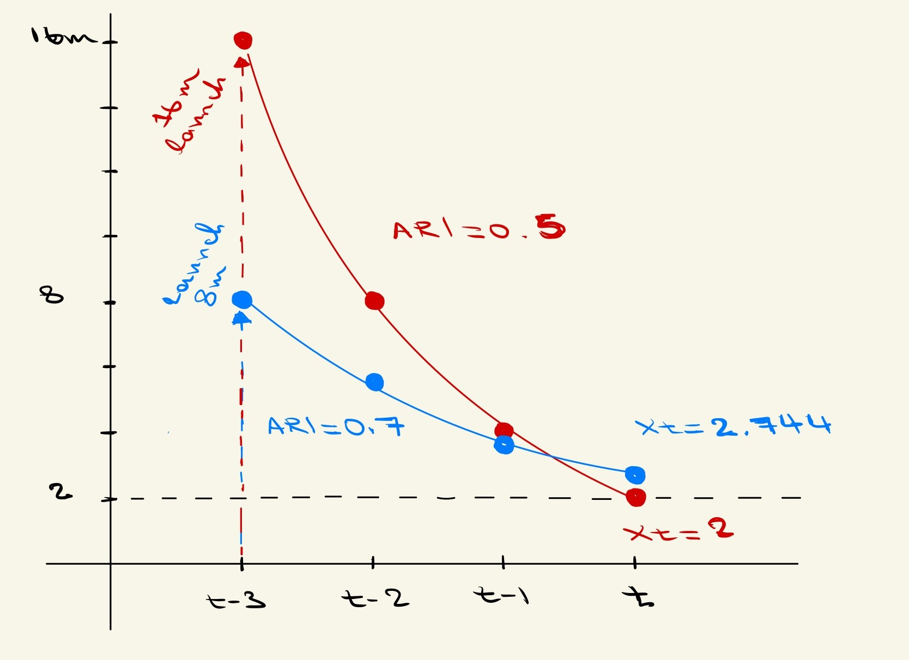
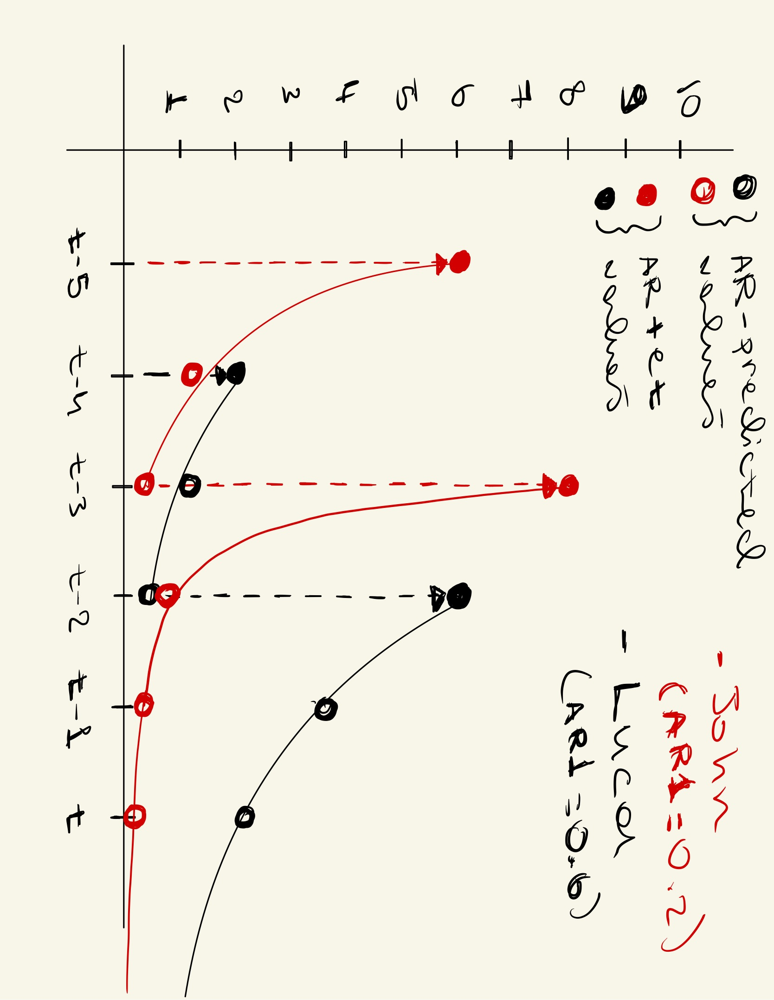

```{r setup, include=FALSE}
knitr::opts_chunk$set(echo = FALSE)

# Learn more about creating blogs with Distill at:
# https://rstudio.github.io/distill/blog.html

```


```{r, layout = "l-body-ouset", fig.width=3, echo=FALSE}

knitr::include_graphics("flyingcat.png")

```

**Story 1: Autoregression and magic cats**

Today, we are launching cats in the air. But don’t worry, these are magic cats. Or so they say. You see some days ago two cats showed up on our doorstep and told us that they could fall from any distance and remain unscathed. These self-purported magic cats bragged about how they learned a simple transformation that allows them to soften their fall. Instead of falling like normal cats, they fall by half of their current distance from the ground every second. So, if a cat is 2 meters above the ground right now, in 1-second they will be 1-meter above the ground and 0.5 meters in 2 seconds. This will continue until the cats are safely on the ground (if they ever make it, but more on this later). Swayed by the charisma of these magic cats we decided to conduct an experiment. We wanted to know if these cats fall differently by launching them 16 meters in the air! As you can imagine, our proposal was not popular with the ethics committee. To gather more evidence that would ensure the safety of the cats we decided to use simulations. In close collaboration with the magic cats, we operationalized their falling process using a short model:

$$
X_t = \beta*X_{t-1} + \epsilon_{t}
$$
To understand this model and ensure the survival of our cats, we decided to create a simple scenario that allows us to solve this equation. This equation states that a cat’s current height ($X_t$) is determined by their height at the previous measurement interval ($X_{t-1}$; in this case a second ago) multiplied by their ability to slow their fall (in this case by half, $\beta=0.5$). The final piece of this equation ($\epsilon_t$) captures any external forces that influence the cat’s current height (imagine spontaneously activated wind turbines that could push the cat higher).

Let’s suppose we do launch a cat 16 meters up in the air. If they can do as they say, then their falling rate over 3 seconds should look like this (grab some pen and paper and follow along):

$$
X_{t} = \beta*X_{t-1} + \epsilon_{t}
$$

We launch the cat in the air. We observe the cat’s height at 4 intervals: $X_{t-3}$ = height at launch 0s, $X_{t-2}$ = at 1s, $X_{t-1}$ = at 2s, $X_t$ = at 3s. Their height at the first measurement ($X_{t-3}$) is fully determined by the launch height. That’s 16 meters. You can view this as an external force affecting our cat’s vertical distance from the ground ($e_{t-3}$).

$$
X_{t-3} = \epsilon_{t-3}\\
X_{t-3} = 16
$$

During subsequent measurements the vertical height of the cat will be defined by its height on the previous measurement interval ($X_{t-n}$) multiplied by the amount that they can slow their fall ($\beta$). For simplicity we will assume there are no other external forces acting upon the cat’s height (i.e. ($\epsilon_{t-n<3}=0$). So, height at each trial is purely determined by the prior height ($X_{t-n}$) and slowing ability ($\beta$).

$$
X_{t-2}=\beta\ast X_{t-3}+\epsilon_{t-2}\\
X_{t-2}=0.5\ast16+0\\
X_{t-2}=8
$$

The cat’s height at the 1-second mark is 8 meters. Next, we halve that to find its height at the 2-second mark.

$$
X_{t-1}=\beta\ast X_{t-2}+\epsilon_{t-1}\\
X_{t-1}=0.5\ast8+0\\
X_{t-1}=4\\
$$

After 2-seconds we have 4 meters.

$$
X_t=\beta\ast X_{t-1}+\epsilon_t\\
X_t=0.5\ast4+0\\
X_t=2
$$

Finally, after 3 seconds the magic cat should be 2 meters above the ground. If you plot the points from the equations you just solved, the red curve in Figure 2 appears. You can see that any forces that cause the magic cats to leave the ground have an exponentially decaying effect on their height. The steepness of this exponential decay is determined by the size of the autoregression coefficient (i.e., the $\beta$). If we increase the $\beta$ to a greater value (e.g. 0.7), the slope of the exponential decay becomes flatter (see the blue line in Figure 1). This means that our cats will linger in the sky for longer, sometimes even when the initial launch is shorter (e.g. 8 vs 16 meters). As for magic cats, they only exist in principle for now. If one day the ethics committee approves of our proposal, these braggadocious felines may need to put their money where their mouth is.

```{r, layout = "l-body-ouset", fig.width=3, echo=FALSE}



```
*Figure 2. The falling rate of cats depends on their autoregression. The red solid line depicts a cat with an autoregression coefficient of 0.5. They halve their falling distance every interval (t-n). The blue solid line shows the falling rate of a cat with a higher autoregressive coefficient (0.7). The blue and red dashed lines show the size of the external force that pushes the cats up at launch*


**Story 2: Autoregression and why your ex will be mad at you forever**

At this point you may be thinking, that’s all nice but I came here to learn things about my ex and how they are like a magic cat. Well then consider a couple that’s about to get into a heated argument: John and Luca. You can follow their story using Figure 3. Currently they are both calm and collected. Let’s say their mood is at its average (mood = 0 in Figure 3). John is more sensitive but does not hang on to his feelings for very long ($\beta=0.2$). Luca is pretty much the opposite. Luca’s mood is hard to shake but once he gets upset, he is likely going to stay that way ($\beta=0.6$). So, this lovely couple is having a relatively boring interaction, when suddenly John notices a notification on Luca’s phone. It’s his sister, or as he likes to call her, bad news. John experiences a sharp spike in his mood ($\epsilon_{t-5} = 6$). A second later, he composes himself. He is (almost) back to average now. Luca notices this unperturbed and asks John what’s the matter. John responds with “nothing”. Luca dislikes this response ($\epsilon_{t-4}=2$), so he looks away trying to conceal his frustration. This upsets John ($\epsilon_{t-3}=7.76$). He grabs Luca by the shoulders and shouts at him. A shocked expression washes over Luca’s face as he pushes John away and locks himself in his room ($\epsilon_{t-2}=5.28$).


```{r, layout = "l-body-ouset", fig.width=3, echo=FALSE}



```
*Figure 3. This figure shows the emotional trajectory of a couple throughout an argument. The dashed lines show the size of the external force their mood receives by interacting with each other. The solid dots show their observed mood which includes the influence of any external pushes. The hollow dots show their mood when it is only affected by their autoregressive coefficient*

What happens next? We leave this to our model. In the absence of any added shocks ($\epsilon_t$) both John and Luca would eventually calm down. Luca much later than John. But the catch is that they would never return to zero in the absence of any perturbations. You see these models assume that perturbations affect a system, be it cat or person, for infinity. But the effect becomes infinitesimally small. This is because if you keep dividing a value by the autoregression coefficient, it will never be zero (unless you do this infinite times). Thus, if they remain unaffected by the external world, our magic cats will never land, Luca and John will never be as cool as when they started, and your ex will be a little mad at you—forever.

**Conclusion**

I hope that through stories of cats and exes you were able to build some intuition about autoregressive models. These models can be used to gain insight into dynamics that move us beyond the mean and deviations from it. Different combinations of volatility and autoregression can lead to insightfully different risk profiles. So, next time you sit and ponder the world around you, try to look at things through the lens of an autoregressive model.

*Author: Michael Aristodemou*

