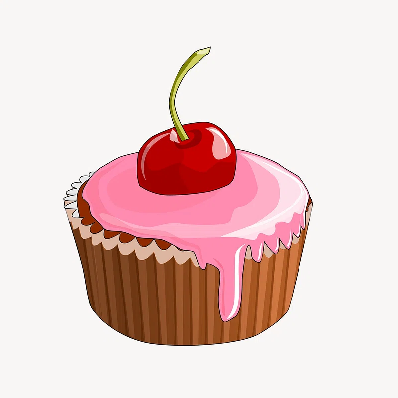

<style>
body {
text-align: justify}
</style>

```{r setup, include=FALSE}
knitr::opts_chunk$set(echo = FALSE)
```

```{r, layout = "l-body-ouset", fig.width=3, echo=FALSE}



```

This year I came up with a New Year’s resolution that I can actually keep: more science communication. So let’s get off to a good start with some science communication… on… science communication! 

In my opinion, science communication entails all communication that aims to convey scientific knowledge, for example, to spark interest or to create awareness or enjoyment. Although we as scientists are not the only ones who can communicate science, the general public puts a lot of faith in our communication; even more so than in that of, for example, the government or journalists (e.g., [KNAW, 2013](https://storage.knaw.nl/2022-07/Vertrouwen-in-wetenschap.pdf); [Rutjens et al., 2018](https://www.sciencedirect.com/science/article/pii/S0065260117300345)). Besides, we are trained to critically evaluate each other’s (and our own) work, to connect different sources of information, and to communicate scientific results in a clear comprehensible manner. I therefore see it as a scientist’s duty to convey what they learn to the general public. Because what is scientific knowledge worth if it doesn’t reach the general public?

**Human beings are curious… also about your work, Polly!**

However, science communication is easier said than done. For instance, how do you decide what to communicate? I know many people who throw in the towel at this point, people like pessimistic Polly. Polly likes science communication, but mainly when other people do it. She assumes “nobody is interested in her findings” because “her research is so fundamental, nobody will understand and nobody cares“. I used to be like Polly but talking to people changed my perspective. Yes… a simple thing like talking to people outside of your scientific bubble helps! It does so because it helps you translate tough science into normal language. And because it helps you realize that everything that you have learned during your studies is new to the general public. Everything that you and your fellow scientists investigate now even more so. People are generally very curious beings, constantly trying to minimize the uncertainty about the world around them. Help them to do so! 

**Times are changing… so take the time, Bart!**

I also met many people that don’t take the time for science communication, people like busy Bart. Bart isn’t such a fan of science communication because “there are so many other, more important things to do”. And in a way, he is right. Science usually doesn’t incentivize science communication. However, times are changing! Nowadays, almost all universities have active science communication departments (who can help!), grants often require some sort of translational impact or outreach, large grants exclusively for science communication are now available (e.g., from the [Dutch Science Agenda](https://www.nwo.nl/en/calls/nwa-science-communication-2023)) and fun initiatives are popping up (e.g., the “[Hoe?Zo! Show](https://hoezoshow.nl/)” and “[Lil’ Scientist](https://eddiebrummelman.com/lilscientist/)”). And even if you don’t care about these things, I would argue communicating your results to a lay public speeds up the writing of your papers: because of character limits on social media platforms, you will notice it helps you think about the main message and how to convey it as clearly as possible.

**Get in touch with your creative side and start simple**

There’s no need to be like pessimistic Polly or busy Bart. Science communication can be for everyone. See it as the cherry on the cake. Get in touch with your creative self and think about what you like to do. Do you like to find hidden gems in the paper jungle? Once you find them, write about it on social media platforms like X (generally good to reach academics) or LinkedIn (generally good to reach non-academics such as clinicians and teachers). Are you more of a visual person? Create infographics once you have results (I know from experience participants really appreciate this way of keeping them up to date). Of course you can make it as crazy as you want. Writing blog posts on your personal or lab website, organizing workshops, recoding podcasts, and so on. However, start simple! Even sharing a new paper on social media counts as science communication.

So stop reading and start communicating!

Jessica Schaaf
