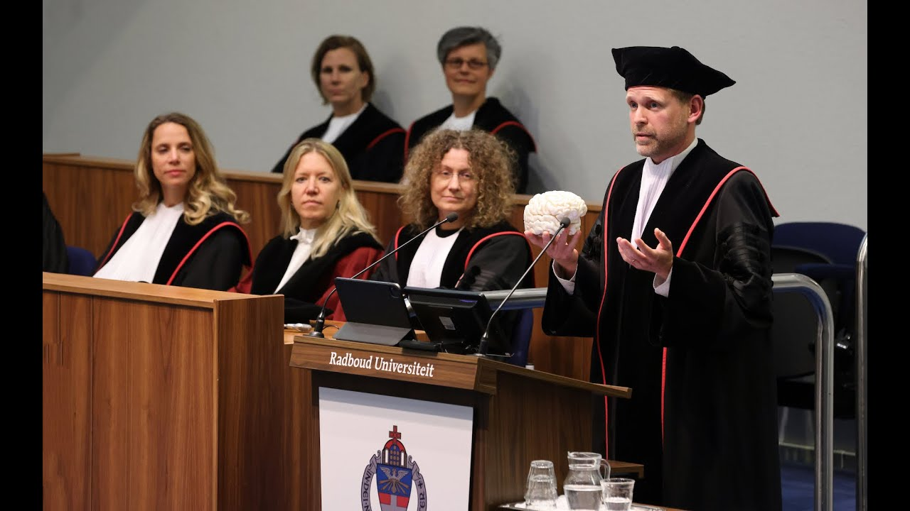

<style>
body {
text-align: justify}
</style>

```{r setup, include=FALSE}
knitr::opts_chunk$set(echo = FALSE)
```


## **Growing Up In Science**

```{r, layout = "l-body-ouset", fig.width=3, echo=FALSE}
knitr::include_graphics("rogier3.JPG")
```


A while back, I was asked to be a guest at the ‘Growing Up In Science’ conversation series. This series of events, initiated by [Wei Ji Ma and Cristina Alberini in 2014](https://www.cns.nyu.edu/events/growingupinscience/background.html), encourages scientists to talk about their personal journey, development, insecurities and struggles, and how they juggle the demands of academia with their personal journey. Below, I have described my (Rogier Kievit’s) story of Growing Up In Science.

```{r, layout = "l-body-ouset", fig.width=3, echo=FALSE}
knitr::include_graphics("rogier1.jpg")
```


### **A wandering mind**

I was born in Delft, the Netherlands in 1982. I was always interested in science, or rather, the natural world. I was (and am) happiest staring into ponds and streams searching for fish, or reading about dinosaurs, snakes and volcanoes. Once, my mother kindly accompanied me to a museum with a rock I had found in the mountains on holiday. In it, I was certain, was a fossilized rodent of some kind. The very kind professional at the local museum explained it was simply a pattern in a very nice rock. 

My childhood was happy and stable and had plenty of academic support. My mother was a lab technician in a biology lab, and later a policy officer at the Netherlands Institute for Advanced Studies, and my father was a surgeon as well as a professor of Medical Decision making. However, my parents made a concerted and successful effort to not translate their own achievements into overbearing pressure on me or my two brothers. In fact, it was my wife who, several years into my PhD, pointed out to me that my father had published a paper in Science, which he had neglected to mention. Similarly, it was my PhD supervisor who pointed out to me that it was quite unique that I did not experience any pressure to perform or achieve, which I am quite thankful for. I have plenty of inner restlessness driving myself forward for it to not be amplified externally. 

Our secondary school encouraged attending University ‘Open Days’ to explore possible degrees, an opportunity I grabbed with both hands. The magnetism of Amsterdam was irresistible, and the open day included a mesmerizing lecture on memory, where the late Christiaan Hamakers demonstrated how chunking could easily triple our memory capacity. Between that visit and devouring the book ‘The Minds’ I’, a collection of short stories on minds and brains edited by Douglas Hofstadter and Daniel Dennett, I knew for sure: I wanted to study psychology, philosophy and neuroscience to better understand the mind and brain. I vividly remember one of my first lectures in philosophy – it was a deeply challenging lecture on logic, from seven to ten in the evening, in the heart of Amsterdam. Afterwards, we walked over the lantern-lit canals to the local pub to continue our discussions on the nature of life, the universe and everything. Studying was everything I hoped it would be.
 
My diverse interests, ranging from psychology, neuroscience and statistics to philosophy (of mind) and data science offered me a lot of academic liberty during my degree and research career. I happened to wander into cognitive neuroscience, but I would have been just as happy with a career in biology, physics, palaeontology or any of the other exciting topics – I regularly experience academic ‘fear of missing out’ when I read about people working at CERN, measuring animal behaviour in the jungle or modelling shark migrations. I started out my career as a PhD student being the ‘brain-person’ in a statistics department and have continued as the ‘statistics person in a brain department’. My diverse interests have meant that I feel (mostly) at home in a lot of places and settings - But also that I never fully belong in one place. I’ve never had a must-attend conference, or a must-read journal. I’ve often thought, especially during my PhD, that it must be easier simply pick a more specific subdiscipline, really dig deep, and be part a single community. At the same time, I know that ultimately that isn’t who I am, and that a key reason I am still excited about the substance of my research is that I’ve been allowed to roam far and wide. 
Of course, even when things go relatively well in academia you’ll have to deal with rejection regularly. I vividly remember that my first paper, that I had worked on for almost 2 years, was out for review while I was on holiday. I made the newbie mistake of checking my work email from our hiking holiday in Scotland, to find not just a rejection, but one that included the phrase ‘this might have been sensible and innovative a decade or so ago.’ Another challenge with my interdisciplinary work and interests is an exacerbation of impostor’s syndrome. Wandering within and between disciplines makes you even more acutely aware that no matter what topic or skill you pick, other people will be more skilled or knowledgeable. I remember arriving in Cambridge and being astounded that someone with considerably greater mathematical skills than my own had simply reimplemented a popular quantitative package in MATLAB. The skills I feel more insecure about tend to feel like magic when I see others excel at them. Over time I learned to manage these feelings and have found some degree of inner peace with my insecurities, knowing that my constellation of weaknesses and strengths is good enough to do my job properly. 


### **The two (three, four…) body problem**

My wife (Anne-Laura van Harmelen, professor of Brain, Safety and Resilience at Leiden University) and I met during our master’s degree, spending our internships at Harvard. Experiencing an entire academic career together, from student to full professor, is very inspiring and rewarding. It also gives me rather acute insight into the many smaller and larger effects of systemic sexism and other forms of bias in society at large and academia more specifically. My academic authority is much more readily assumed than hers, no matter the setting or topic. I’ve always been acutely aware of the many privileges I’ve had – my father was a professor, my mother worked as an academic editor, and I’m a white, cis, hetero male raised bilingually in a country that funds higher education properly. I have tried to ‘spend’ some of this academic privilege on trying to improve these disparities and work towards causes I value, from equality and diversity to open science and climate action. In addition to their intrinsic value, I think spending time and mental space on bigger problems is valuable, as it often gives more immediate and tangible rewards compared to the delayed and ethereal impact of more purely academic work. 
At the end of our PhD, we visited Cambridge (UK) together, ultimately translating into a postdoc opportunity for both of us to work at the MRC Cognition and Brain Sciences Unit. We hoped to move to Cambridge, have our child there, and for me to finish my PhD in the first two months before the postdoc started and the baby arrived. However, our son had different plans in store….


### **(Less than) one in a million**

Five days before we were supposed to emigrate to the UK to our new life, our son was born. Nine weeks premature, so small, and so fragile. Our belongings moved to the UK without us. Living in our empty apartment in Amsterdam was an apt metaphor of our experience of becoming parents. Our son confined to a beeping, buzzing incubator. After eight weeks of ups and downs in the hospital, we were finally allowed to leave and, within days, move across the channel with our son. By now he was a huge baby to us, but still a tiny baby to everyone else. 
After settling into our new home, country and job, I could choose between two options. Only focusing on finishing my, already delayed, PhD thesis, would mean that the large project (Cam-CAN) on which I was a postdoc would inevitably barge ahead without me. But if I only focused on my new postdoc, it would become increasingly hard, if not impossible, to finish my thesis. So, for several months I did both, in a schedule I cannot enthusiastically endorse. From 9:00-5:00 I was a regular postdoc. After that, we picked up our son from daycare, and we did all the parenting things together, dinner, bath, bedtime. At around 20:00 or 20:30 I cycled back to work, to work on my PhD thesis until about midnight, fuelled by Twirl bars from the vending machines and the enjoyment of scaring the security guard on his rounds through the building. Apart from that period, we have mostly resisted the toxic ‘work all the time’ ethic. Little did we know that some of the most challenging times were still ahead.
On the 31st of August 2013, I finally finished my PhD thesis, sent it over to my PhD supervisor, and celebrated with an ice-cold beer and an early bed. Around midnight, we woke up because of some odd noises coming from our son’s bedroom. I rushed over, and found him blue in the face, almost unresponsive. We called an ambulance, who arrived 8 minutes later, and rushed to the hospital where his seizures and breathing problems subsided.
Over the next few weeks, we slowly descended the ladder of diagnostic prevalence. First diagnosis: febrile seizures associated with sudden fever spikes. 1 in 20. But the seizures kept coming back, without any fever. Next diagnosis: infantile spasms. 1 in 2000. Then, tuberous sclerosis. 1 in 15000. None of the symptoms quite fit, and none of the treatments quite worked. Finally, after all other avenues had been exhausted, our doctor conducted a full genetic screen. The diagnosis came back: ‘Ring 14 chromosome disorder’. Only 76 reported cases in the published literature. Our son was 1 in… 80 million? Our diagnostic rollercoaster came to an end, only to be replaced by a less metaphorical one. In total, we had to take more than 20 ambulance trips due to severe epilepsy – We even started to be recognized by ambulance crews when walking around Cambridge, who waved kindly at our son Flynn. Ambulance crew are lovely people, but you generally don’t want them to recognize you. It was a time when work and home life collided jarringly. Before, I might have glossed over sections in neuroscientific papers referring to participants with ‘refractory epilepsy’. But now I had a much more visceral appreciation about what that simple phrase means for them, their families and surroundings.
It was also a time where the intrinsic value of being a scientist was a powerful way to keep us going. It allowed me to wrench some degree of control back from our circumstances - Yes, I was a father, but I was also other things. Although neither of our supervisors in any way forced us to work (quite the opposite), being able to combine long days in the hospital with work was an incredibly valuable activity. And no matter what the universe threw at our family, this gave us some sense of autonomy, control and agency. Both Anne-Laura and I even ended up submitting fellowship applications from the A&E department, to not let our hard work go to waste. We’ve since kept some of this stubbornness, refusing to let our son’s challenges dictate what we could and couldn’t achieve.
Although I have been very lucky in my academic career, I also experienced my share of disappointments. One particularly impactful one was being shortlisted to become a postdoctoral fellow at St. John’s College in Cambridge. This historical place seemed like magic to me, and the idea that I could be a small ‘part of it’ was extremely exciting. I was very nervous for the interview. During the interview I was extremely focused on not making any ‘mistakes’, and was therefore (I suspect) an extremely boring candidate. Unsurprisingly, I didn’t get the fellowship. A later round of a similar interview with a different college, I was far less nervous – I was relaxed, myself, and willing to share my actual ideas and views. It went much better. Although the disappointment of the first interview (in my own performance more than not getting the position) was tough, it was a valuable lesson in that playing it safe is rarely the better option. I committed to more fully being myself for any future career opportunities. 
In 2015, a stroke of brilliance by our son’s clinical neurologist led to the introduction of two new medications to help with his epilepsy and immune problems. Suddenly, he was 100% seizure free, a treatment so successful our son is now a published case study. At the same time, the uncertainty of my professional future hung above us like a cloud. Our daughter was about to be born, and I only had a few months left on my postdoc contract, with no clear options. Moving would be very hard, and one possible job opening was less science and more organisational, not a move I was hoping to have to make. Should we go back to the Netherlands, to at least have more of a social support structure with the children? Or ‘stick it out’ and hope something would come on our path? 
 Luckily, I was shortlisted for a Wellcome Trust fellowship, and my interview was scheduled 10 days after our daughter was born. The fact that both she and my wife were healthy gave me a healthy dose of perspective. The otherwise daunting, U-shaped collective of 15 stern professors were suddenly quite a bit less daunting than they might otherwise have been, and I was lucky to be awarded the fellowship. Within the space of 2 months, we were now a family of four, I suddenly had at least some semblance of job security, and our regular ambulance trips were a thing of the past.
Our son’s rocky road has taught us a lot of valuable life lessons. During our PhD’s, we regularly pushed up against, and over, our own limits. Although our time working in the US and seeing firsthand the excesses at Harvard and MIT gave us a healthy scepticism of the culture of always being in the lab just to be seen, we were not entirely immune to this pressure. One benefit, if you can call it that, of spending as much time in various wards of hospitals is to instil a good sense of perspective. We decided that we would, at least as a rule, not work on weekends, and don’t work excessively in the evenings, and try to model that behaviour to our labs. Rather than harm our productivity, I think it has made us more balanced and efficient. Academia can be very demanding, but the notion that it is only possible to be successful if you spend 70-80 hours in the lab is simply nonsense. 

```{r, layout = "l-body-ouset", fig.width=3, echo=FALSE}
knitr::include_graphics("rogier6.JPG")
```

### **A home away from home?**

We were quite happy living in the UK, and especially Cambridge. I like the feeling of living abroad. It made me behave more as a tourist: Scouring google maps for sightseeing spots, or blobs of undifferentiated green, to go and explore. The period of stability after my wife and I established our own groups was somewhat short-lived. Like many others, we never expected the Brexit vote to go the way it did – but suddenly we woke up in our neighbourhood, and every single house around us had an English flag outside their house. This vague sense of unease was compounded by an election that explicitly suggested children from the EU were the reason schools were too full. Somewhat by chance (or perhaps not), we were both invited to apply for professorships in Leiden and the Donders institute. My wife had very fond memories of her time in Leiden as a PhD student, and for me the Donders was exactly the international, interdisciplinary hub I feel most at home in. We both got the jobs. Next step: trying to move countries, find schools, and even buying a house over videochat during the first pandemic lockdowns. 

### **Back home**

```{r, layout = "l-body-ouset", fig.width=3, echo=FALSE}

```


Accepting our new posts gave a healthy renewed dose of impostor’s syndrome. The academic career goal (and stability) of a position of full professor (hoogleraar) had been achieved – but in practice, it didn’t seem to mean very much. I was still stuck behind the kitchen table, trying to figure out how to get started in a new post through a maze of intranet pages and 3 factor logins. The main change in my role seemed to be my email signature. But, we slowly settled in, and I now have a wonderful, international lab who show me every day how to do things differently, and often better, than I would. Although life is a bit more stable now, children with special needs are often able to throw a curveball. Right now, I’m writing this section from beside my son’s hospital bed, where we have been for 8 days and counting. Writing, whilst keeping an eye on the saturation monitor which has been our window into a(nother) bout of pneumonia. Our son’s ups and downs still happen, and they are still not easy, but we have gotten better at dealing with them, and to fit them in in our larger, more balanced picture of our identities. 
A career in academia isn’t easy, but it can be immensely rewarding. The most important thing is to stay curious – about the work you do, about yourself and the people around you, and about the world around us. The best way to maintain that childlike sense of wonder and curiosity is to find ways to change your perspective – That can mean traveling, diving into new topics or collaborations, or reading well beyond your own field. Moreover, you need a healthy balance between your role and life as a scientist, and the even more important ‘everything else’ – Including the arrival of a very welcome daughter to our family this summer. I love the idea of playing a very small role in this human endeavour, stretching across millennia, of unravelling nature’s mysteries. Having laid a brick, or half a brick, in this edifice of knowledge and wonder we have built, I marvel on many days that I’m able to make a job of figuring things out. I wouldn’t want it any other way.

```{r, layout = "l-body-ouset", fig.width=3, echo=FALSE}
knitr::include_graphics("rogier4.png")
```
