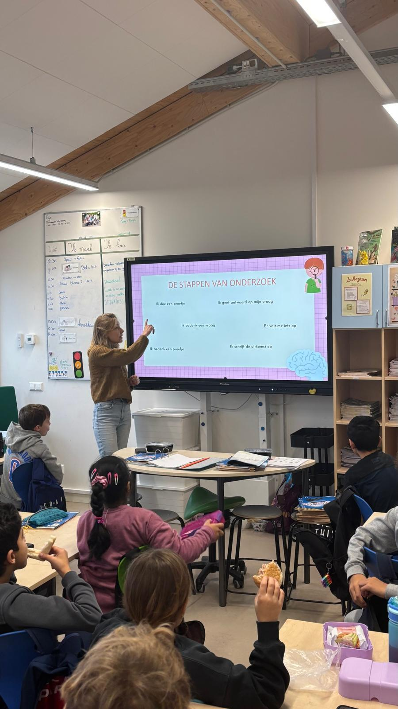
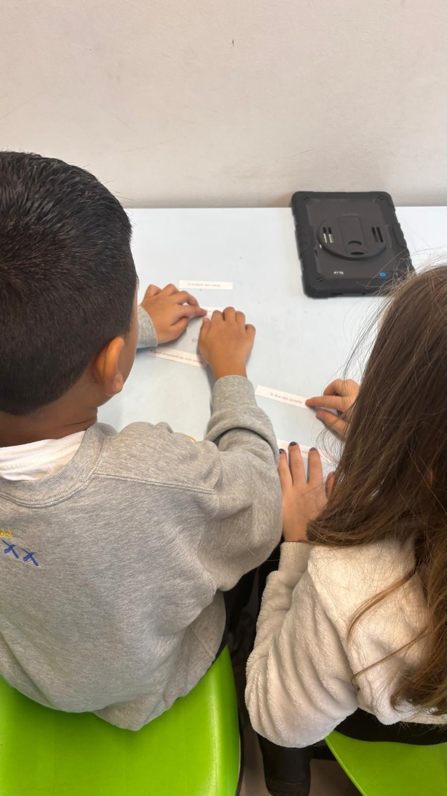
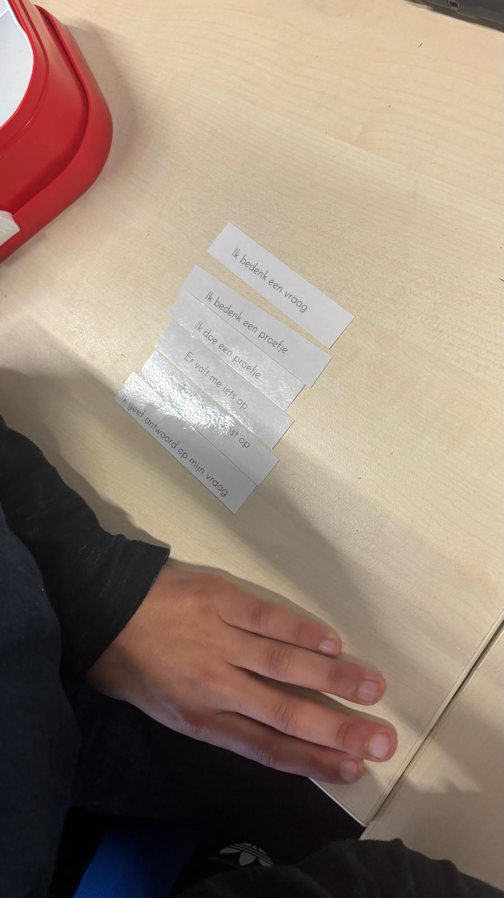

<style>
body {
text-align: justify}
</style>

```{r setup, include=FALSE}
knitr::opts_chunk$set(echo = FALSE)
```

```{r, layout = "l-body-ouset", fig.width=3, echo=FALSE}

```

As a big thank you to the participating classes in the CODEC project, we offer guest lectures on various topics. We developed our own CODEC-teaching packages: one on being a scientist, one on senses and one on cognition. The lessons are a nice mix between theory and practice, and are freely available on the CODEC website (so feel free to [take a look!](https://www.codecstudie.nl/klas.html)). In all lessons we invite children to discuss what they already know about the topic and start from there. After we’ve gaged the children’s knowledge we build up a theoretical framework in which we create space for thinking and for asking questions. We keep the children’s age in mind and adapt to what they are capable of. For example, in the higher grades we ask more questions about why they think certain phenomena occur and whether they can think of logical explanations for their classmates’ questions before answering ourselves. In the younger classes, we keep the explanation more concise and help out some more!

To stimulate the integration of knowledge, we incorporate small experiments in which the children can experience for themselves how science works. This way, they learn to answer their questions about the world by doing their own research. We start off with a research question, followed by an “experimental” set-up. We ask the kids to perform the task, take measurements and write down their findings in groups. For example, we let the children couple 3D printed brains of various animals to the corresponding owner of the brain. Another example is throwing sandbags as close to a target to find out whether that is easier with your eyes open or shut. After the experiments we go through their findings together, discuss differences between groups and try to find an explanation. Some kids thought of interesting and creative reasons for the outcomes which actually surprised us, and were very possible. We always finish the experiment by asking what went well, what was more difficult and could be improved upon. In this way kids cycle through all the phases of the scientific process in a playful manner. Everyone can be a scientist! We’ve already heard some might want to become our colleagues in the future.

<div style="display: flex; gap: 10px; align-items: center;">
  
  
</div>

In our experience the children participate actively in our lessons, ask lots of interesting questions and even some critical ones. Some kids for example asked us how the brain actually remembers all of its experiences. Another asked us why we are able to smell. Immediately a hand shot into the air. A classmate eagerly responded that it was probably so that we can smell smoke when there is fire. Other kids were interested in how seeing works and why some kids have to wear glasses. It was clear that we are teaching things to little scientists already, as the stream of questions was endless. Of course we could not answer all the questions, but we explain that a lot can be discovered by doing small experiments like the ones in the guest lecture. 

The children welcomed the exercises with loads of excitement. This behaviour could best be described by “hyperthousiasm”. Getting them back into the classroom after the experiments turned out to be quite the challenge, as most of them insisted on doing more of the experiments. Unfortunately, the time didn’t allow us extra experiments. Fortunately, they did come back into the classroom and discussed their findings with us. They even gave us feedback in the end. One class wanted to end the guest lecture with their tips and tops for us, which we willingly accepted. According to them we explained the subjects thoroughly and answered their questions well. We thanked the class and went back to Trigon with a great feeling and hope for many more guest lectures to come!
