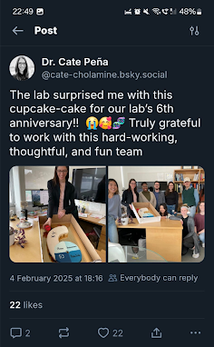
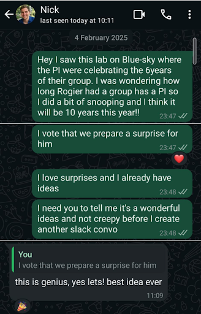
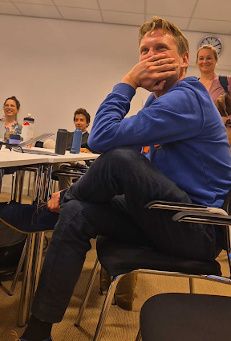
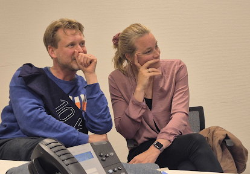
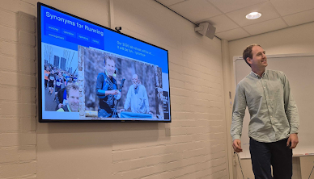
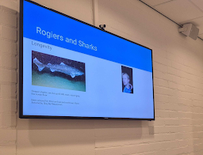
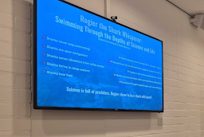
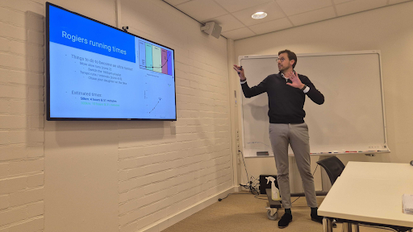
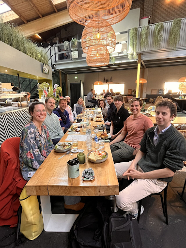

<style>
body {
  text-align: justify;
}
</style>

Too often, anniversaries are missed, and wins pass uncelebrated in science. Here, we outline our master plan behind ambushing Rogier.

<div class="boldlist">

**1. Get an idea**

<div class="left-center">
  
  <p>
  The idea came from a post on Bluesky from a PI celebrating their lab’s 6th year anniversary. 
  A very thoughtful surprise coming from their lab that inspired a pressing question: 
  how long has Rogier been a PI for?
  <br><br>
  After a bit of snooping around, I found out that Rogier was hired as a Programme Leader Track 
  scientist in Cambridge in 2015. Ten years, it had to be celebrated.
  </p>
</div>

<br>

**2. Find an accomplice**  

<div class="right-center">
  
  <p>
    To achieve this grand scheme, I needed an associate, someone mental enough to add a ton of extra work on top of their busy schedule: Nicholas Judd. Nick accepted right away and found out that Rogier started his position in May 2025, which gave us three months to prepare the best 10 years as a PI surprise party. 
  </p>
</div>

<br> 

**3. Develop your plan**  
<p>The key to surprise is *monotony*… So we decided to ambush him during a normal lab meeting. Our lab occasionally conducts [‘presentation roulette](https://katebennet.medium.com/presentation-roulette-c49828dbdf1c),’ where everyone prepares three slides on a random topic, and they are shuffled around. This format is ideal for honing non-content-specific presentation skills; yet, today it would serve as the perfect ambush mechanism.
</p>

<p>Our plan was as follows:</p>

<ol type="a">
	<li>Have Rogier unknowingly present about himself after he was “randomly” chosen</li>
	<li>Have the next presenter break the surprise</li>
	<li>All the following presentations would be about him interspersed by videos from people from his past</li>
	<li>Go out to lunch & get him to pay!</li>
</ol>


<p>
Yet, first we needed to involve more people…
</p>

</div><br>

**4. Find a date**

<p>The whole plan had to be flexible. As a parent of three children, Rogier often has to change his schedule following unexpected issues. So from the beginning we planned the surprise to be easily transferable to any day. 


The initial plan was to have the surprise during the lab meeting of the 1st of May, which transformed into the 8th of May when one of us realized that Rogier was absent on the schedule for this lab meeting. 

But no fear, Jessica stepped in and delivered a very engaging journal club and we got back on track for the 8th of May.

</p>

**5. Bring in the experts**

```{r echo=FALSE, out.width="100%"}
knitr::include_graphics(c("Expert.png"))
```

<p>
The first step was to bring his wife, Anne-Laura, into the loop. This would ensure that he would show up in person & things would go smoothly. We also got Jordy (a PhD-student in the lab) to book a one-hour meeting after lunch – ensuring he was free for a longer period.
After we had the logistics in place, we started reaching out to people from his past to record videos that we could play in between presentations.
</p>


**6. Be sneaky**

<p> 
He needed not to catch on to our master plan! 

This involved him presenting first on slides entitled “The evolution of a PI”, with the next person (Nick) slowly breaking the surprise. Crucial to this working was Rogier’s belief that both the slides and his position as first were randomly assigned.

A few lab meetings before we started using random seeds to assign people to present, along with the order of presentations. We iterated through a few until we got Rogier first and me 2nd.

Surely he wouldn't question what the "all mighty" seed says!

</p>

```{r echo=FALSE, out.width="100%"}
knitr::include_graphics(c("Almighty_Seed.png"))
```

**7. Get the gifts**

<p>
On top of the presentation, we wanted Rogier to have a more physical memory of this celebration. In agreement with the lab, we ordered a “World’s Best Boss” mug from the Office. Not because we think of him as Michael Scott, but because we genuinely think he is one of the few PIs who is a very good supervisor on top of being an excellent scientist. We also wanted something to let everyone else in the building know that it was a special day for Rogier. So I (Léa) sewed him a sash - yeah, like the one that Miss & Mister Universe wear - that "10 years PI".
</p>


**8. Procrastinate & panic**

<p>
Of course now that the plan was in action, we procrastinated for a week on the final details. We were very lucky to have a committed lab that helped on all our tasks and pushed the project to the finishing line with us. 
Each lab member created a small presentation on Rogier with the instruction to present “about anything, from serious to funny, as long as it is about Rogier”. A lot of sharks, breads and running presentations were written. 
</p>

**9. Force Rogier to follow our secret plan**

Now that everything was in motion, we had to keep Rogier on the right path.

For the surprise to go according to plan, the lab meeting had to follow a meticulous schedule, particularly for the presentation. A random seed was “generated” to align with our program, putting Rogier as the first presenter. 

Rogier, on the other hand, had a different plan…

```{r echo=FALSE, out.width="100%"}
knitr::include_graphics(c("Convincing_Rogier.png"))
```

**10. Enjoy the fun!**

<div class="photorow photorow-one">
  
</div>

<div class="photorow photorow-two">
  
  
</div>

<div class="photorow photorow-one">
  
</div>

<div class="photorow photorow-two">
  
  
</div>

<div class="photorow photorow-three">
  
  
  
</div>

<div class="photorow photorow-two">
  
  
</div>

<div class="photorow photorow-two">
  
  
</div>

<div class="photorow photorow-one">
  
</div>

<div class="photorow photorow-one">
  
</div>

_**Now we need to break it to him that he needs to pick up the bill!**_


