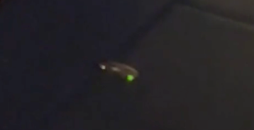

We recently went for our annual writing retreat together with (almost) all the members of our LCD-lab. This time we stayed in the lovely rolling surroundings near Berg en Dal, which is a stone's throw away from Nijmegen. Our stay was located between a vineyard and a beautiful forest called the ‘Reichswald’ that stretches all the way over the border and into Germany. 

```{r echo=FALSE, out.width="100%"}
knitr::include_graphics(c("Landscape.png"))
```


Our retreat was introduced by Rogier who gave us a presentation about the forthcomings, updates and future visions of our lab. Rogier discussed the broader mission of the lab, the core research question (How, and why, do people differ in cognitive ability, and change across the lifespan?), as well as some quantitative (e.g. 51,215 lab Slack messages!) and qualitative (three lab members, Aran, Ciske, and Feline found PhD positions) milestones. This was followed by a short roundtable of our developmental goals for the upcoming year. Shortly after Rogier’s presentation we went on with the main goal of the retreat: writing!


```{r echo=FALSE, out.width=c("45%", "2%", "45%")}
knitr::include_graphics(c("Working.png","spacer.png", "Working2.png"))
```


Hard work is followed by leisure and pleasure. After this first writing block of the retreat some of us went for a relaxing stroll through the woods, whereas others got on with cooking a delicious meal for the group. Before dinner however, a secret activity was planned. Of course, lab members also move on, and this year this had to be the last retreat of two essential lab members - Nick and Lea! The only right way to honour them is, of course, with the great big Nick and Lea quiz! Good to mention that this quiz was made from a conspiracy between lab members including Nick and Lea themselves. They both assumed that the quiz was made for the other party (contributing insider’s stories and photos), but it was in fact for both.

```{r echo=FALSE, out.width=c("55%", "2%", "35%")}
knitr::include_graphics(c("QuizPic.png", "spacer.png", "QuizQuestions.png"))
```
<div style="margin-bottom:30px;"></div>


<div style="display:flex; align-items:center; margin-bottom:30px;">
  
  <p style="margin:0; font-size:1.1em;">
   The first day was concluded by a cozy games night and we even spotted some fireflies, which was astonishing. 
  </p>
</div>
  
  
  After we woke up and started the second day fresh and with a nice strong mug of coffee, everyone continued writing on their projects. Following a long stretch of focused writing, it was finally time for the group to head out on a relaxing hike through the woods. Aran, our tour guide through the forest, took us on an adventure and showed us amazing viewpoints on the way. At the end of our hike, pancakes awaited us on the Duivelsberg (the devil’s mountain) for lunch. 

<div style="display:flex; align-items:center;">
  
  
</div>


With our bellies full of delicious pancakes, we headed back to our cabin. The way back was a bit risky, because our guide led us onto a road where cars went by with speeds up to 80 km/h. Luckily, we survived the danger! Safely back in our cabin, we went on with a shut up and write session during which we could give each other feedback on our pieces of text. We concluded the writing session yet again with another secret leisure activity. This secret activity consisted of a quiz on silly fails and pictures of all the lab members. At the end of our quiz we had a secret goodbye present for two other leaving (and returning) lab members, namely Ciske and Feline. Luckily they always return, just like boomerangs, so we do not have to say goodbye to them for long.

```{r echo=FALSE, out.width=c("30%", "2%", "60%")}
knitr::include_graphics(c("Hike3.png", "spacer.png", "Pancakes.png"))
```


Our last evening was filled with some fun games like Mind and Saboteur, providing a great opportunity to sync our cognitive abilities, and develop our team work skills. When our final Wednesday afternoon writing session came to an end, it was time to say our goodbyes. Our brains were empty, our spirits high, and we were grateful for such a successful, productive, and fun retreat!

