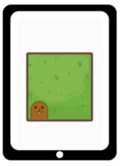
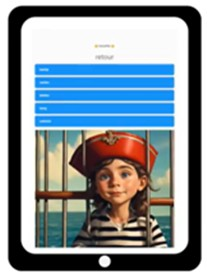
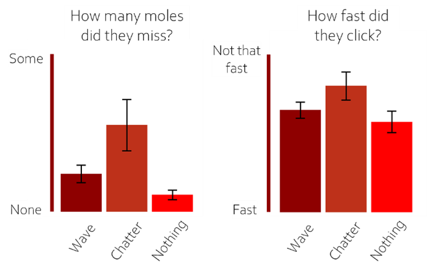

```{=html}
<style>
body {
text-align: justify}
</style>
```
```{r setup, include=FALSE}
knitr::opts_chunk$set(echo = FALSE)
```


At the Lifespan Cognitive Dynamics lab, we like to bring science back to the people it is about. We do not only find this fun but also think it is important to educate the general public on our latest findings. That is why members of the lab joined two science festivals in the last months: [Kletskoppen festival](https://kletskoppenfestival.nl/), in which children and their parents learned all about language, and the [Donders Open Day](https://www.linkedin.com/posts/labs-escape-rooms-share-7425567832228270080-hARa?utm_source=share&utm_medium=member_desktop&rcm=ACoAABPPgx8B9W05XTtmxjZvdJue8PMGaKTtUXk), on which individuals of all ages visited the Donders Institute to step into the wonderful world of the brain. Have you ever experienced difficulties concentrating on what you are doing when people around you talk? Or do you prefer to work while listening to music? These are examples many people may recognize. You can get distracted by sounds in the environment, making it difficult to focus on the task at hand. This is what we aimed to let festival visitors experience. We invited them to perform fun cognitive games on a tablet while hearing different sounds through headphones. Afterwards, we asked them how they experienced the tasks and how they were affected by the sounds.


```{r, out.width = "40%", fig.align = 'center', echo = FALSE}

```

*How did we come up with this experiment?*

Since January 2024, we have been running our big CODEC study in which we investigate how and why children’s cognitive performance, like processing speed and vocabulary, differs between children and differs from moment-to-moment within the same child. Preliminary results show that children process information more slowly and experience more problems retrieving the meaning of words when it is noisy in the classroom. Jessica and Rogier wondered whether this holds for sound in general, or whether some types of sound may be more detrimental than others.

*What did the experiment look like?* 

That is why we came up with an experiment in which participants played two games, one in which they assisted pirate Codec in digging up treasures by clicking on moles that guarded them as fast as possible (measuring processing speed) and one in which they helped to free pirate Codec from his rivals by indicating the meaning of words (measuring vocabulary). While playing, participants heard a continuous wave-like sound, busy playground chatter, or nothing.

<div style="display: flex; gap: 20px; justify-content: center;">
  
  
</div>

<br>

<div style = "text-align: center;">
  <audio controls>
    <source src="pinknoise.mp3" type="audio/mpeg">
    Your browser does not support the audio element.
  </audio>
  <p><em>Wave-like sound (pink noise)*</em></p>
</div>

<div style = "text-align: center;">
  <audio controls>
    <source src="playground.mp3" type="audio/mpeg">
    Your browser does not support the audio element.
  </audio>
  <p><em>Playground chatter*</em></p>
</div>

*Both sounds are originally from [BBC Sound Effects](https://sound-effects.bbcrewind.co.uk/).

*What did we find?*

Especially young children (between 5 and 8 years of age) are affected by sounds, and mostly so by playground chatter. As shown in the figure, children missed more moles and clicked moles more slowly when hearing chatter. Vocabulary seemed unaffected by different sounds.


```{r, layout = "l-body-ouset", fig.width=3, echo=FALSE}



```

*What could this mean?*

These results could imply that young children do not yet possess good coping strategies to make sure they can still perform the task at hand in a noisy environment.
