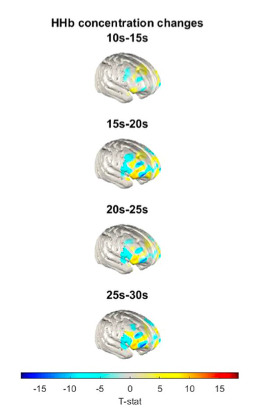
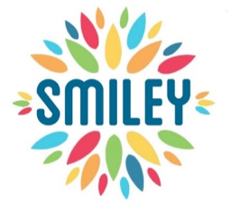

```{r setup, include=FALSE}
knitr::opts_chunk$set(echo = FALSE)
```

At the Lifespan Cognitive Dynamics Lab, we often work with existing (inter)national datasets, but also contribute to, and lead, data collection on large longitudinal cohorts which we make publicly available to the greatest extent we can within our varying ethical mandates. Below you will find the four main studies we work on, representative papers by lab members, and  how to access the data. If you are interested in the pros and cons of using secondary datasets to study development, we wrote a paper, including some resources beyond our own, below:

Kievit, R. A., McCormick, E. M., Fuhrmann, D., Deserno, M. K., & Orben, A. (2022). [Using large, publicly available data sets to study adolescent development: Opportunities and challenges. Current Opinion in Psychology](https://www.sciencedirect.com/science/article/pii/S2352250X21001950?via%3Dihub), 44, 303-308.

---

## CODEC (2025-2028, age 7-13)
The CODEC cohort is an ERC funded accelerated 3-year longitudinal study which encompasses 600 7-to-10-year-old children. Each year includes a ‘burst’ week (3 times per day, 5 days per week) of cognitive measurements on five cognitive domains (reasoning, working memory, processing speed, vocabulary, exploration), conducted both in classrooms and at home through experience sampling assessment. The CODEC study will allow us to examine the structure, causes and consequences of cognitive variability in childhood. As of May 2025, we have collected data on 261 children and approximately 150.000 trials. 

```{r, out.width = "40%", fig.align = 'left'}

```


```{r, out.width = "60%", fig.align = 'right'}

```

Data availability:

CODEC behavioural data will be made available to the wider community through the [Radboud Data repository](https://data.ru.nl) as soon as data collection and cleaning has finished.

Example paper from the lab:

You can find the design of the study, the background, as well as our hypotheses, in our Open Access Study Protocol paper:

Coolen, I. E., van Langen, J., Hofman, S., van Aagten, F. E., Schaaf, J. V., Michel, L., ... & Kievit, R. A. (2024). [Protocol and preregistration for the CODEC project: measuring, modelling and mechanistically understanding the nature of cognitive variability in early childhood](https://bmcpsychology.biomedcentral.com/articles/10.1186/s40359-024-01904-5). BMC psychology, 12(1), 407.

---

## DMPL (2025-2032, age 8-17)

The DMPL study is a Wellcome Trust funded collaboration between Cardiff University (Derek Jones, lead PI, Marianne van den Bree, PI), Cambridge University (Sarah-Jayne Blakemore, PI) and RadboudUMC/Donders Institute (Rogier Kievit, PI)

Using unique imaging and biophysical modelling we will develop the most comprehensive characterization of brain microstructural development in adolescence. This will reveal how cellular size/density and myelination change and impact typical cognitive and social-affective development and mental health, focusing on typical and atypical development (TD and AD) in late childhood and adolescence. This will revolutionise our understanding of the interplay between specific aspects of brain microstructure, cognitive and social-emotional development, and how variation between individuals impacts on individual differences in mental health vulnerability. 

```{r, out.width = "90%", fig.align = 'left'}

```

---

## BLOCCS (2026-2033, N=300, age 0-5 years)

The BLOCCS study is a Wellcome Trust funded collaboration between Bristol University (Karla Holmboe, lead PI), Cardiff University (Mara Cercignani, PI) and RadboudUMC/Donders Institute (Rogier Kievit, PI). In the BLOCCS study (Bristol Longitudinal study Of Childhood Cognition from infancy to School), we will investigate the development of these core ‘cognitive building blocks’ and their interplay with brain structure and function from infancy to the first year of school.
BLOCCS will follow the babies of parents already enrolled in the ALSPAC every 6 to 12 months up to age 5. We will be able to test longitudinal cascade models where cognitive domains, brain structure and brain function co-develop and interact, eventually leading to key outcomes at school age. 

```{r, out.width = "30%", fig.align = 'left'}

```

```{r, out.width = "50%", fig.align = 'right'}

```


In the news: 

[What goes on inside toddlers' brains? A pioneering project is trying to find out](https://www.bbc.com/news/articles/cvg71z808q9o)

[Building blocks of cognition: The co-development of brain function and cognition across the first 5 years of life](https://wellcome.org/research-funding/funding-portfolio/funded-grants/building-blocks-cognition-co-development-brain)

--- 

## C-MEC (2025-2028, age 5-11)

The Cognitive Microscopy in Early Childhood (C-MEC) study is collaboration between the LCD lab and the DPB Lab (PI: Prof. Carolina de Weerth), part of the worldwide [LEVANTE](https://jacobsfoundation.org/levante-welcomes-first-cohort-of-participating-sites-to-global-research-network/) (Learning Variability Network Exchange) program. Our study, called C-MEC, will test the LEVANTE protocol in two unique cohorts, called Skippy and Smiley.  

```{r, out.width = "40%", fig.align = 'left'}

```

```{r, out.width = "40%", fig.align = 'right'}

```

Data availability:

Levante Data from our and other studies will be made freely available throughout the duration of the project. Keep an eye on the LEVANTE website.

---

## CALM (2014-2022, age 5-18)

The Centre for Attention, Learning and Memory [(CALM)](https://calm.mrc-cbu.cam.ac.uk) is an MRC-funded research centre specialising in understanding how children attend, listen and remember. We aim to understand how these skills impact on learning from childhood through to adolescence.

```{r, out.width = "50%", fig.align = 'left'}

```

Data availability:

Data from the CALM study can be requested through the managed access data portal. Please include a description of your aims and research question and carefully read the submission guidelines. 

Example papers from the lab:

Simpson-Kent, I. L., Fried, E. I., Akarca, D., Mareva, S., Bullmore, E. T., CALM Team, & Kievit, R. A. (2021). Bridging brain and cognition: A multilayer network analysis of brain structural covariance and general intelligence in a developmental sample of struggling learners. Journal of Intelligence, 9(2), 32.

Astle, D. E., Holmes, J., Kievit, R., & Gathercole, S. E. (2022). Annual Research Review: The transdiagnostic revolution in neurodevelopmental disorders. Journal of Child Psychology and Psychiatry, 63(4), 397-417.

Fuhrmann, D., Simpson-Kent, I. L., Bathelt, J., CALM Team Holmes Joni Gathercole Susan Astle Duncan Manly Tom Kievit Rogier, & Kievit, R. A. (2020). A hierarchical watershed model of fluid intelligence in childhood and adolescence. Cerebral Cortex, 30(1), 339-352.

---

## Cam-CAN (2011- current, age 18-102)

The Cambridge Centre for Ageing and Neuroscience [(Cam-CAN)](https://cam-can.mrc-cbu.cam.ac.uk) is a BBSRC and ERC funded interdisciplinary research project that aims to further our understanding of human ageing. The project uses data from a range of sources to better understand changes in cognitive and neural functioning across the lifespan, and to understand how we can best retain cognitive abilities into old age.

```{r, out.width = "50%", fig.align = 'left'}

```

Data availability:

Data access can be requested through the portal, here. Over 1500 groups have gained access to this unique dataset

Example papers from the lab:

Kievit, R. A., Davis, S. W., Mitchell, D. J., Taylor, J. R., Duncan, J., & Henson, R. N. (2014). Distinct aspects of frontal lobe structure mediate age-related differences in fluid intelligence and multitasking. Nature communications, 5(1), 5658.

Kievit, R. A., Davis, S. W., Griffiths, J., Correia, M. M., & Henson, R. N. (2016). A watershed model of individual differences in fluid intelligence. Neuropsychologia, 91, 186-198.

de Mooij, S. M., Henson, R. N., Waldorp, L. J., & Kievit, R. A. (2018). Age differentiation within gray matter, white matter, and between memory and white matter in an adult life span cohort. Journal of Neuroscience, 38(25), 5826-5836.

Borgeest, G. S., Henson, R. N., Shafto, M., Samu, D., Cam-CAN, & Kievit, R. A. (2020). Greater lifestyle engagement is associated with better age-adjusted cognitive abilities. Plos one, 15(5), e0230077.

McCormick, E. M., & Kievit, R. A. (2023). Poorer white matter microstructure predicts slower and more variable reaction time performance: evidence for a neural noise hypothesis in a large lifespan cohort. Journal of Neuroscience, 43(19), 3557-3566.


