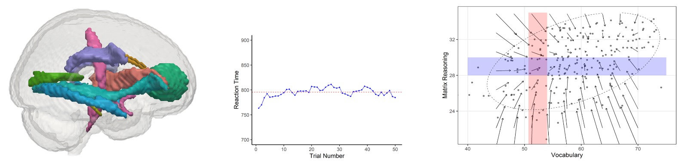

###  The Lifespan Cognitive Dynamics Lab studies change in brains and behavior across the lifespan

```{r header, layout = "l-screen-inset", echo=FALSE}



```


In the Lifespan Cognitive Dynamics lab we are interested how, and why, cognitive abilities differ between people and change across the lifespan. Based at the [Donders Institute](https://www.ru.nl/donders/)  in Nijmegen/[RUMC](https://www.radboudumc.nl/en/research/research-groups/developmental-neuroscience). To study these questions we use a range of multivariate methods in large samples to examine how cognitive abilities affect each other, how brain structure and function supports changes in cognitive abilities, and how cognitive functioning interfaces with lifestyle factors such as physical and mental health, social and intellectual engagement and environmental factors. Our research is supported by the Medical Research Council, NWO, the Jacobs Foundation, the Wellcome Trust and the European Union. You’ll find our newest papers and preprints [here]( https://lifespancognitivedynamics.com/publications.html), and our lab manual with our values and practices [here <i class="fas fa-download"></i>](papers/LifespanCognitiveDynamics_LabManual.pdf).
