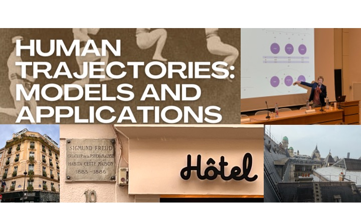
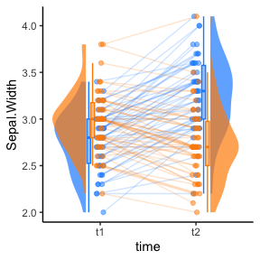
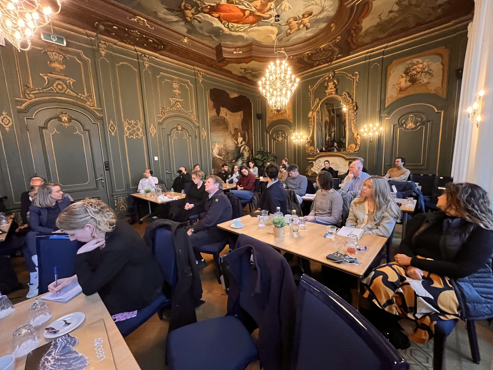
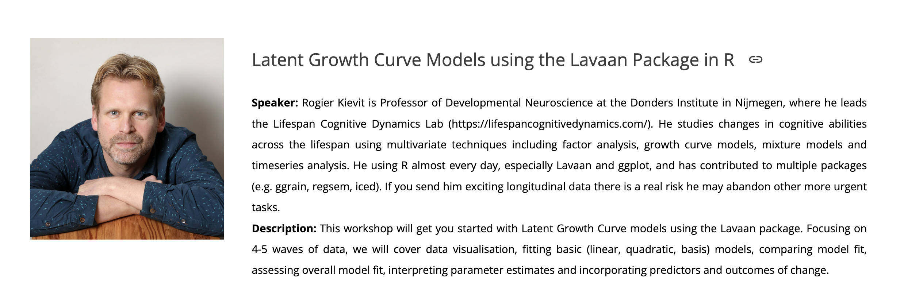
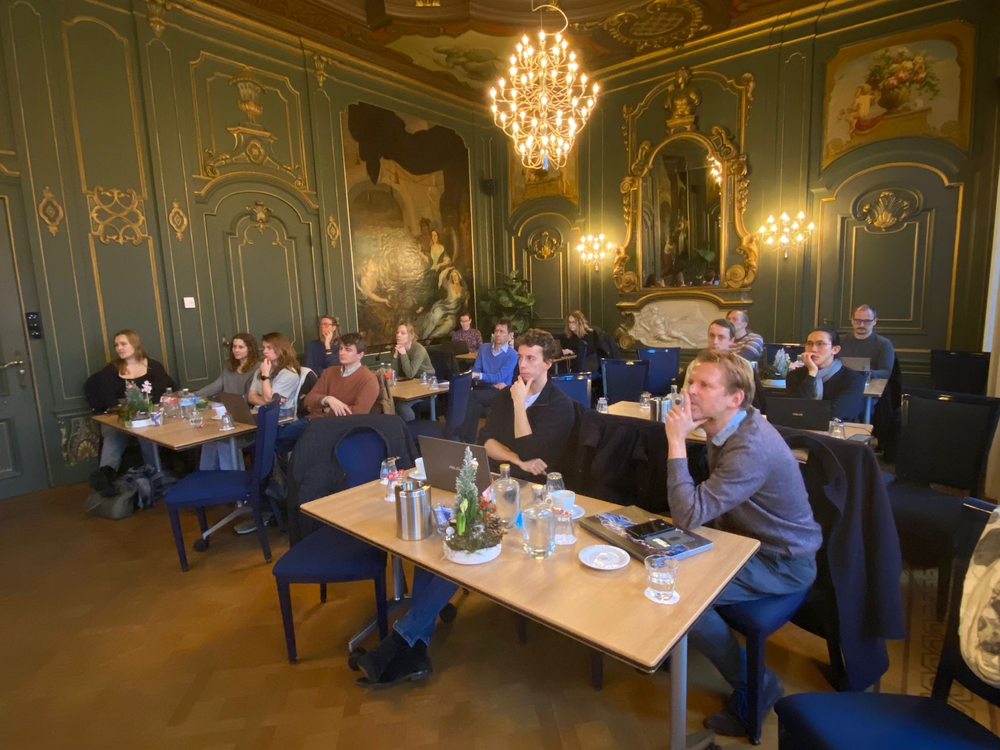
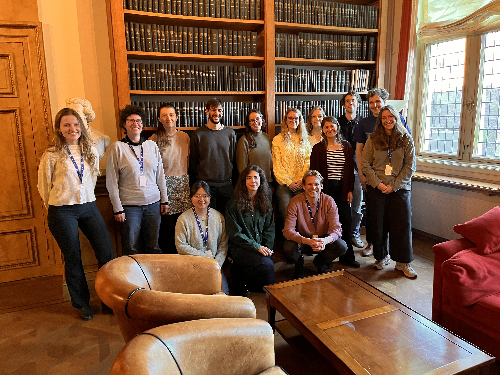
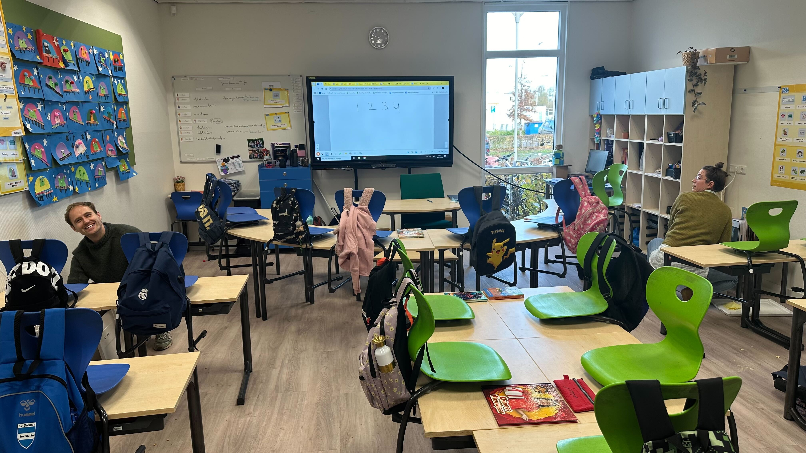
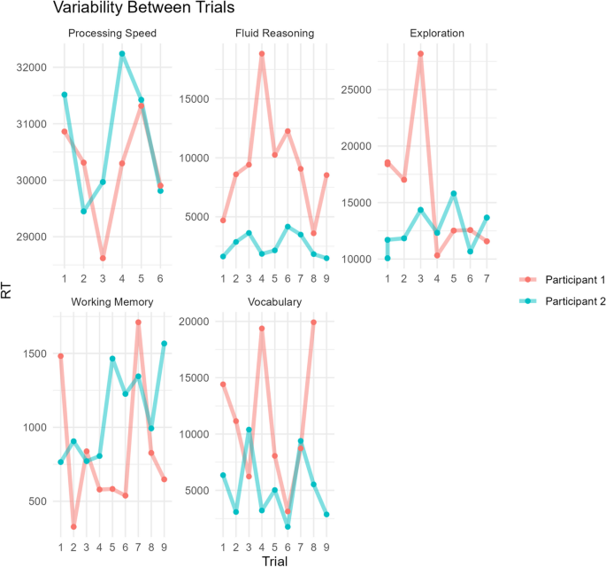
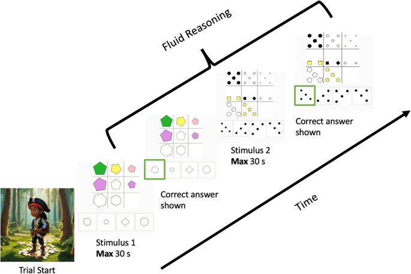

```{r setup, include=FALSE}
knitr::opts_chunk$set(echo = FALSE)
```

## Talk in Paris

21st of March:

Paris workshop on Human Trajectories

Rogier was invited to speak in Paris at an exciting workshop organized by [LaPsyDÉ](https://www.lapsyde.com) on neurodevelopmental trajectories. It was a chance to share our own work on [brain maturation](https://linkinghub.elsevier.com/retrieve/pii/S1053-8119(22)00623-1) and cognitive variability, but also to hear about innovations on disease progression, learning rates, adaptive educational platforms. We got a tour of the amazing LaPsyDÉ institute (former home of Binet and Piaget), whose offices have some of the best views of Paris. We also  did a bit of sightseeing and baguette eating of course.


```{r, out.width = "60%", fig.align = 'left'}

```

---

## New and old members

1st of March: 

Over the past few months we have seen some changes in the Lab. Ilse Coolen was awarded a Marie Curie Fellowship and is now working in Leuven and Oxford. [Michael Aristodemou](https://scholar.google.com/citations?user=AXBd2n4AAAAJ&hl=en) submitted his PhD thesis, and has started as a postdoc with [Prof. Charles Driver](https://scholar.google.co.uk/citations?user=713cSToAAAAJ&hl=en&oi=ao) in Zurich. We have also welcomed several new lab members: Eric Fleischer joined the CODEC project as RA, Ciske Jansen is working as lab manager, and Aline Korver, Afon Mohammed Khari, Ema Jovanovic, Caroline Wunn and Lena Kohler are working with us on their internships.

---

## Two new tutorials available!

Thursday February 27th:

Always wanted to analyze your longitudinal or time series data but don't know where to start? Try our open online tutorials on [Latent Growth Modeling](https://www.njudd.com/assignment_workshop_lgms.html) and on [Dynamic Structural Equation Modeling](https://jessicaschaaf.github.io/jessicaschaaf/dsem-workshop.html)! Very hands-on. Yes, you can do it too, we promise!

---

## New paper ggrain paper and download milestone

February 2025

Our raincloudplots team (led by Nick and Jordy) has published a brief [paper](https://www.biorxiv.org/content/10.1101/2024.12.13.628294v1.abstract) explaining the possibilities in the ggrain package (vignette [here](https://cran.r-project.org/web/packages/ggrain/vignettes/ggrain.html)). Another milestone: The ggrain package has been downloaded 30.000 times! 


```{r, out.width = "40%", fig.align = 'left'}

```

---

## BDD workshop ‘Integrating patients and other stakeholders into our science’.

17th of January 2025:

As part of the Research Programme [‘The Brain Across Development In Health and Disease’](https://www.radboudumc.nl/en/research/research-programs/the-brain-across-development-in-health-and-disease), Janita Bralten and Rogier organized a workshop on ‘Integrating patients and other stakeholders into our science’. We heard from Martine Hoogman, Janneke Zinkstok, Wouter Staal and Jelle van Gurp about how to best engage patients, families, patient organizations and many stakeholders, to ensure not only the highest quality science, but that our findings have impact where it is needed most.


```{r, out.width = "60%", fig.align = 'left'}

```

---

## Workshop Latent Growth Curve Modeling (for Ukraine) 

16th of January 2025:

Rogier gave a [workshop](https://sites.google.com/view/dariia-mykhailyshyna/main/r-workshops-for-ukraine) on longitudinal modeling using latent growth curves. It is part of a rather amazing series of workshops on using R for data science put together by PhD student [Dariia Mykhailyshyna](https://sites.google.com/view/dariia-mykhailyshyna/main), with all proceeds going to support charity efforts in Ukraine – Do check out upcoming workshops, as they are all excellent.

```{r, out.width = "60%", fig.align = 'left'}

```

---

## In person launch of REMAC

16th of December 2024:

We had our first in person REMAC meeting in Huize Heyendael. The [REMAC centre](https://www.ru.nl/en/donders-institute/research/di-funded-research-projects/research-projects/remac-radboud-ecological-momentary-assessment-center), founded by Rogier and [Janna Vrijsen](https://www.radboudumc.nl/personen/janna-vrijsen) and supported by Aran van Hout, brings together people from across campus to share ideas, methods, best practices and challenges in experience sampling and Ecological Momentary data Analysis work. It was really exciting to see new collaborations be initiated, and (e.g.) PhD students finding others with similar challenges. Our next meeting will be in March 2025.

```{r, out.width = "60%", fig.align = 'left'}

```

---

## Urai lab shared meeting

28th of November 2024:

We had a shared labmeeting with the [COCOSYS lab](https://anneurai.net) led by Anne Urai. As often happens, there were many areas of overlap and synergy between our interests. For instance, check out [Anne’s new paper](https://osf.io/xk6gm_v1/) on understanding structure in the noise of human performance. Beyond pure science, we also discussed our mutual passion for being a climate responsible scientist and lab, and what we can do to improve the future of the planet.

```{r, out.width = "60%", fig.align = 'left'}

```

---

## Ilse Coolen and Nick Judd receive prestigious fellowships

30th of November: 

Nick Judd received a Jacobs Fellowship, and will extend his work on natural experiments to understand the impact of environmental factors on brain development. Congratulations Nick!

---

## Protesting budget cuts to education and research

30th of November 2024:

Several members of the lab attended the protests on the Malieveld, opposing drastic budget cuts to education and science.

---

## Data collection in CODEC starts!

18th of November 2024:

After years and months of grants, ethics approval, piloting and task development, we have finally started data collection in CODEC! We are going into the classroom with our tablets to measure cognitive performance three times a day for 5 days. So far, the children are enjoying the tasks, and we can see the data coming in. 

```{r, out.width = "60%", fig.align = 'left'}

```

---

## Codec protocol paper published & variability in anthropoids

1st of September 2024: 

We have published the [protocol paper](https://bmcpsychology.biomedcentral.com/articles/10.1186/s40359-024-01904-5) for our ERC funded CODEC study. In the paper, a true group effort, we describe the design, tasks and background of the study. More importantly, we specify a series of directional hypotheses we will be testing as the study progresses. In the meantime, if you’re interested in reading more about cognitive variability, we’ve published a [collaborative paper](https://www.cell.com/callback?red_uri=%2Ftrends%2Fcognitive-sciences%2Ffulltext%2FS1364-6613%2824%2900287-0&code=lys5-KAkLxFd2gru-IFbUiIVzWDdGQaH4Pp2BiMN&state=15634851811) with Farshad Mansouri and Mark Buckley exploring the neural underpinning of response time variability in anthropoids.

```{r, out.width = "50%", fig.align = 'left'}

```

```{r, out.width = "50%", fig.align = 'right'}

```

--- 

## Open Science news

Thursday May 2nd:

Two events today - Aran van Hout is starting his post to work on our NWO funded Open Matrices project, welcome Aran!

On the same day, Jordy and Nick gave another raincloudplots workshop at the lab of Sharon Kolk. Make it rain!

```{r, out.width = "35%", fig.align = 'left'}
knitr::include_graphics("images/news/nick.jpeg")
```

```{r, out.width = "35%", fig.align = 'right'}
knitr::include_graphics("images/news/jordy.jpeg")
```


## Sunny lab lunch! 

Monday 29th of April:

In the absence of the weekly Bring Your Lunch, we moved into Nijmegen for a nice Lab lunch with guest Luisa Fassi!


```{r, out.width = "60%", fig.align = 'left'}
knitr::include_graphics("images/news/lab_lunch.jpg")
```

---

## A new lab vacancy 

25th of April: 

As of today, we are looking for a new post-doc to strengthen our exciting CODEC project!

The vacancy can be found [here:](https://www.radboudumc.nl/en/vacancies/142603-postdoc-developmental-cognitive-neuroscience)


---

## National Research Software day 2024 

23rd April:

Rogier gave a keynote at the National Research Software day in Hilversum. He highlighted the untenable tension between how important Open Source Software is on the one hand with how fragile, in terms of funding and staffing, it is on the other. 

A recap of the National Research Software day 2024 can be found [here!](https://www.esciencecenter.nl/news/national-research-software-day-recap/)

```{r, out.width = "80%", fig.align = 'left'}
knitr::include_graphics("images/news/softwareday.jpeg")
```

--- 

## A shared labmeeting


April 13th: 

We had a shared labmeeting with the Predictive Clinical Neuroscience Lab headed by Andre Marquand. A wonderful meeting where excellent ideas and knowledge were exchanged! 

```{r, out.width = "60%", fig.align = 'left'}
knitr::include_graphics("images/news/shared_labmeeting.jpg")
```


--- 

## New people

April 2nd: 

Luisa Fassi has joined our lab as a guest visiting PhD student from Cambridge, welcome!

```{r, out.width = "35%", fig.align = 'left'}
knitr::include_graphics("images/people/Luisa.png")
```

Also, we have welcomed a new intern: Jesse Willems! 

```{r, out.width = "35%", fig.align = 'right'}
knitr::include_graphics("images/people/Jesse.png")
```

---

## Lab photo

March 21st: On this day, we (almost) had the entire lab in 1 place!

```{r, out.width = "50%", fig.align = 'left'}
knitr::include_graphics("images/people/The_Lab.jpg")
```


---

## Marie Curie fellowship for Ilse!

March 10th: Ilse Coolen receives a Marie Curie fellowship and the lab wants to congratulate her on this fantastic achievement!

```{r, out.width = "50%", fig.align = 'left'}
knitr::include_graphics("images/people/Ilse_Coolen.jpeg")
```

```{r, out.width = "50%", fig.align = 'right'}
knitr::include_graphics("images/news/mariecurie_ilse.png")
```


---

## Green Award for Lea Michel

February 9th: During the weekly Bring Your Lunch, Lea Michel wins team player award for her many efforts to make the CNS department an (even) better place to be, congrats Lea!

```{r, out.width = "50%", fig.align = 'left'}
knitr::include_graphics("images/news/Lea_green_award1.png")
```

```{r, out.width = "50%", fig.align = 'right'}
knitr::include_graphics("images/news/Lea_green_award2.png")
```

---

## Congrats to Dr. Jessica Schaaf

November 17th: (Dr.)  Jessica van der Schaaf is awarded her PhD after a spirited defense 

```{r, out.width = "30%", fig.align = 'left'}
knitr::include_graphics("images/people/Jessica_Schaaf.jpg")
```


---

## Now live! the raincloudplots shiny app

Ever wanted to make pretty plots representing your data? Raincloud plots are your friend. Check out this shiny app developed by our own Nick Judd and Jordy van Langen

https://lcdlab.shinyapps.io/raincloudplots-shiny/


---

## Merging of the labs

20/04/2023

The LCD lab and Professor Anne-Laura van Harmelen's Center for the Integration of Resilience Complexity Leiden
(https://www.circlenl.com/) joined forces to share ongoing research and discuss potential opportunities for future collaborations between our groups. 


---

## Successful Lab retreat!

13/04/2023

With so many new group members and projects getting started, the lab retreat could not have come at a better time. Our exalted leader, Rogier, shared the history of the lab and his vision moving forward. Importantly, the day made space for us to collectively help shape the future of the group - not only in terms of the research agenda, but the research culture we wanted to be part of. 

A highlight of the day was presentation roulette, we each prepared 3-4 slides on a random talk and another person presented them without seeing them first. Topic highlights included: why I'm the best bridge builder, violent crustaceans, and just how much is the average Dutch person made of sugar?

---


## New lab members: Emma Meeussen and Sophie Hofman

01/04/2023

Emma Meeussen and Sophie Hofman have joined the lab to work on the CODEC project. 

---

## Website update

23/03/2023

Exciting times, we've updated the lab webpage!

```{r, out.width = "60%", fig.align = 'center'}
knitr::include_graphics("images/news/smile.png")
```

---

## LCD lab swarms ICPS in Brussels

15/03/2023 


The LCD lab was present at ICPS in Brussel with two symposia. Led by Lea Michel and Michael Aristodemou, they presented exciting new results on day to day variability in cognitive performance and on the co-development of white and grey matter in childhood and adolescence

```{r, out.width = "60%", fig.align = 'center'}
knitr::include_graphics("images/news/ICPS.png")
```

---

## New lab preprints using the ABCD sample

12/03/2023 
Two new lab preprints, both on the ABCD sample. Lea Michel examines the complementary prediction of grey and white matter, as well as distinct metrics within each in predicting cognitive performance https://www.biorxiv.org/content/10.1101/2023.03.06.529634v1.article-metrics
Sam Parsons uses novel tools of reliability decomposition to show differences in longitudinal stability/reliability across brain regions, structural measures (cortical thickness in particular), scanner types and ABCD testing sites.
https://psyarxiv.com/zpu6t/


---

## New lab member: Jessica Schaaf

01/03/2023

Welcome to the lab member Jessica Schaaf! Jessica is a expert in computational modeling and data analysis. She will be working as a postdoc on modeling timeseries of cognitive performance, teasing apart individual differences in feedback learning and examining developmental curves of exploration-based learning. Find out more about her work [here](people.html)


---


## New Lab visitor: Kathryn Bates
20/02/2023

Dr. Kathryn Bates is visiting the lab from King’s College London for several months to study the impact of adversity on trajectories of wellbeing in childhood and adolescence, cycling around the Netherlands and presenting her innovative work on science outreach and stakeholder engagement.  https://www.kathrynbates.com/ 


```{r, out.width = "60%", fig.align = 'center'}
knitr::include_graphics("images/news/Kathryn.jpg")
```


---


## New lab member: Ilse Coolen 

01/02/2023

Welcome to the lab Ilse Coolen! Ilse an expert in developmental cognitive neuroscience, with a special interest in the development of mathematical abilities in childhood. She will be working as a postdoc on the ERC funded CODEC project. Find out more about her work [here](people.html)

---


## Fourth raincloud plot workshop a success


10/01/2023

40 participants joined. Expertly led by Nick Judd and Jordy van Langen, they learned how to make raincloud plots using R and Python. For more info, see https://github.com/RainCloudPlots/RainCloudPlots

```{r, out.width = "60%", fig.align = 'center'}
knitr::include_graphics("images/news/raincloud-workshop.png")
```


---


## LCD Lab at the Donders Open Science day


20/10/2022

Lab members Lea Michel and Michael Aristodemou excited the next generation of scientists at the Donders Open Science day, teaching them about different animal brains, illusions, brain cells and so much more.

```{r, out.width = "60%", fig.align = 'center'}
knitr::include_graphics("images/news/openscience.jpeg")
```


---


## Lab alumni take up faculty posts at Leiden University


01/09/2022

Lab alumni Ethan McCormick https://e-m-mccormick.github.io/ and Ivan Simpson-Kent https://www.universiteitleiden.nl/medewerkers/ivan-simpson-kent#tab-1 have both accepted posts as assistant professor at Leiden university – We wish them the best of luck!


