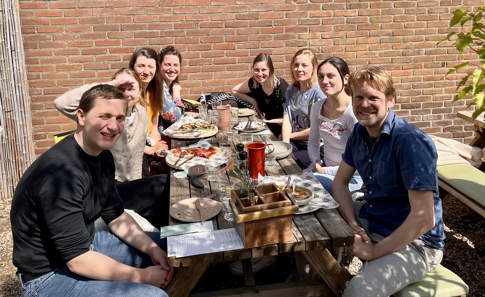
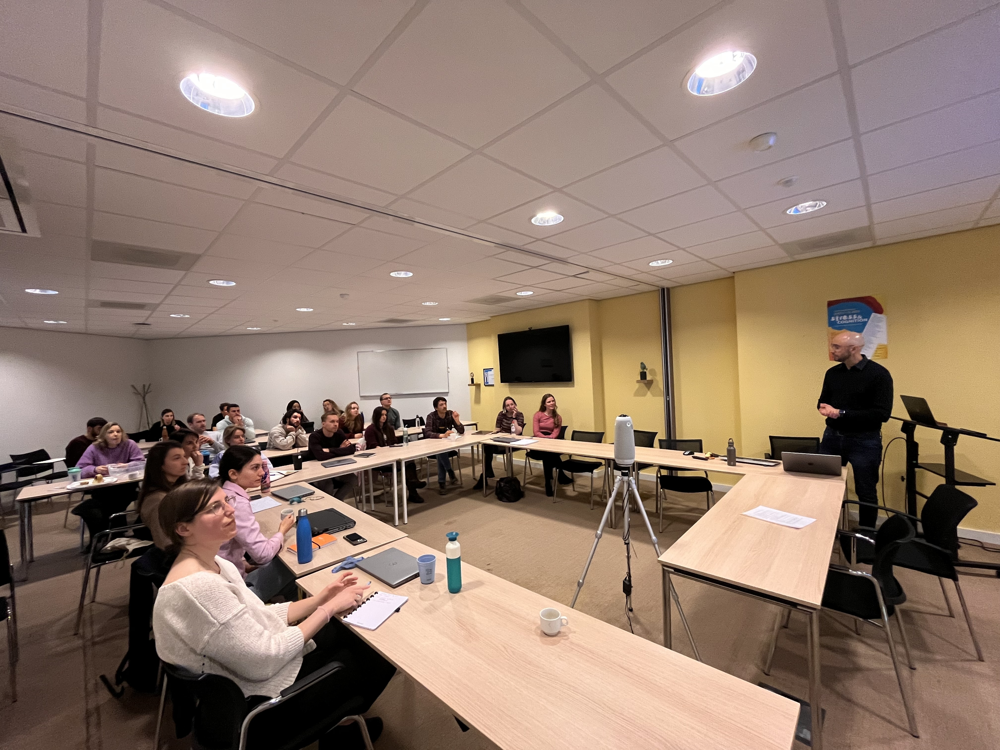
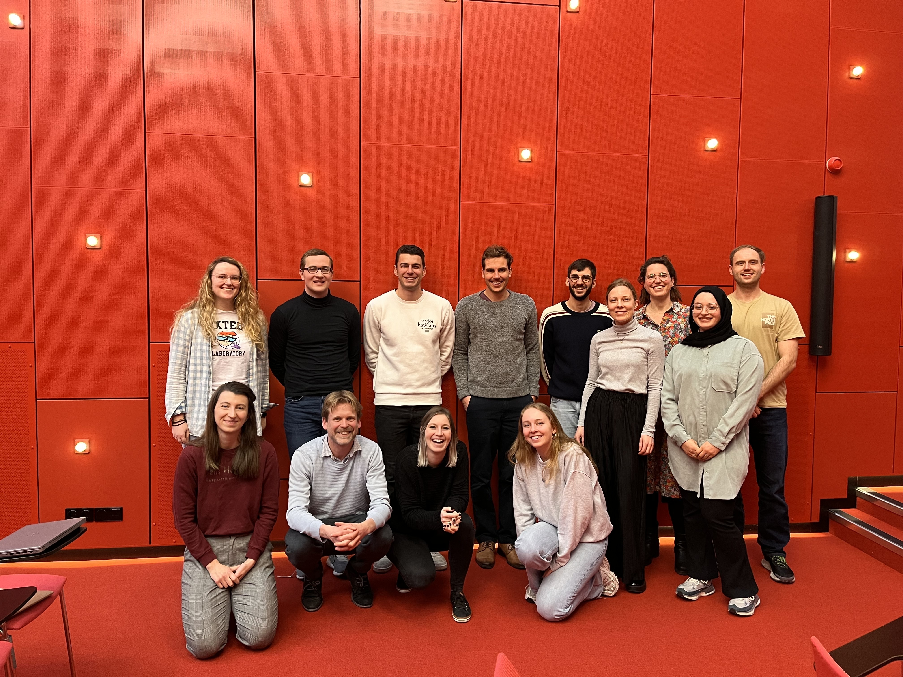
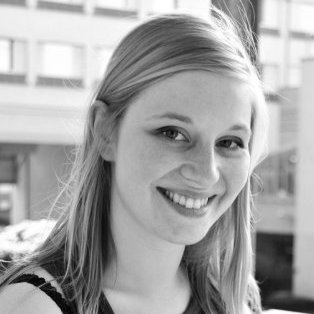
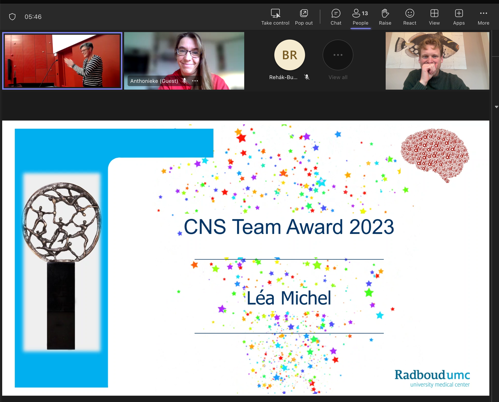
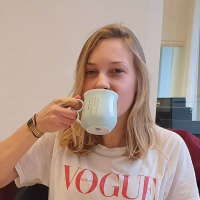
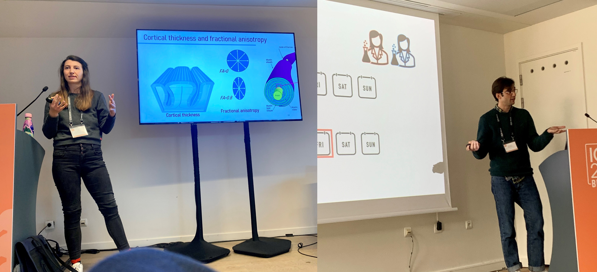
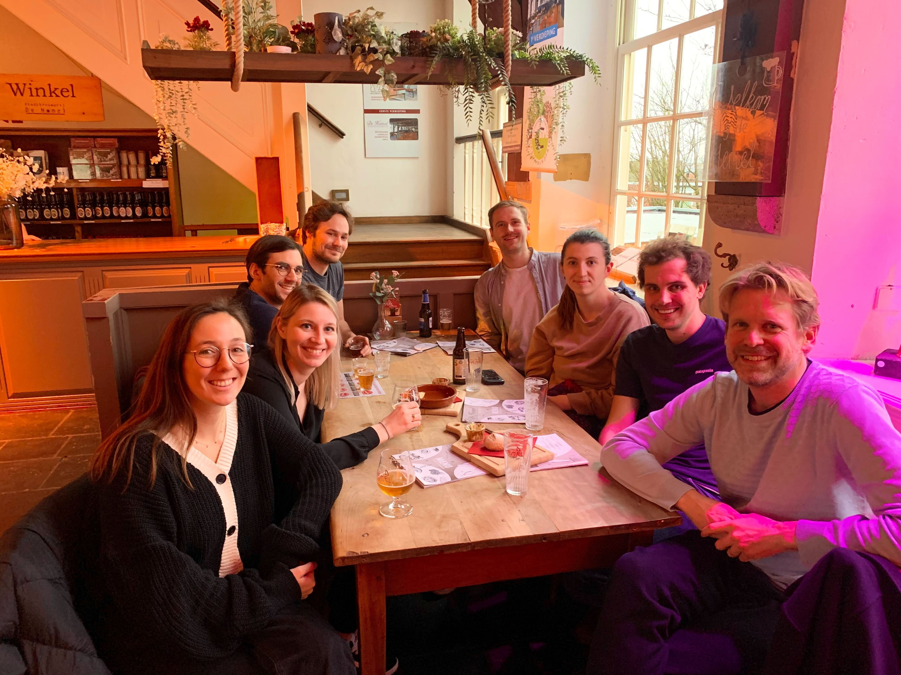
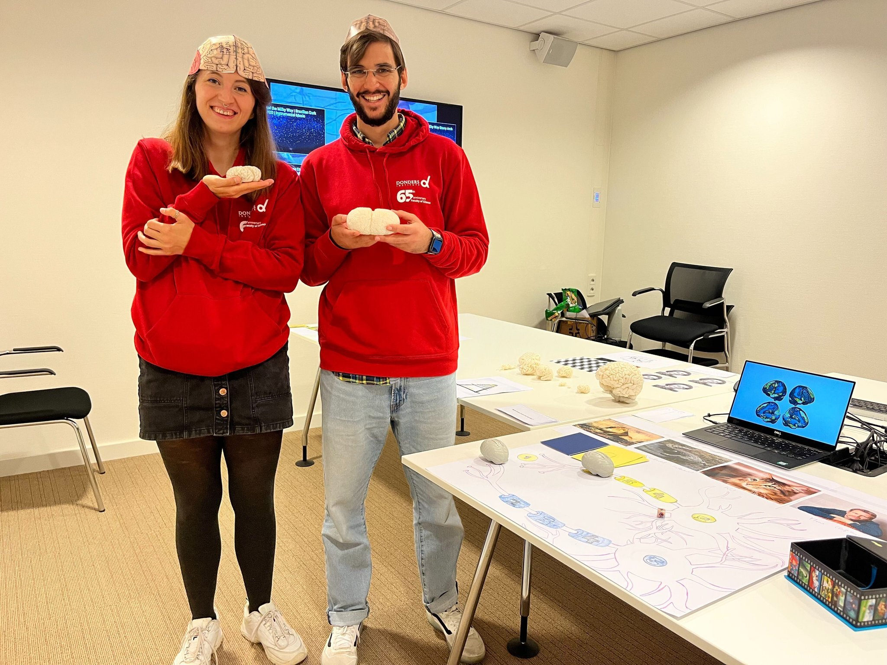

```{r setup, include=FALSE}
knitr::opts_chunk$set(echo = FALSE)
```
---

## Two new tutorials available!

Thursday February 27th:

Always wanted to analyze your longitudinal or time series data but don't know where to start? Try our open online tutorials on [Latent Growth Modeling](https://lifespancognitivedynamics.com/assignment_workshop_LGMs.html) and on [Dynamic Structural Equation Modeling](https://jessicaschaaf.github.io/jessicaschaaf/dsem-workshop.html)! Very hands-on. Yes, you can do it too, we promise!


## Open Science news

Thursday May 2nd:

Two events today - Aran van Hout is starting his post to work on our NWO funded Open Matrices project, welcome Aran!

On the same day, Jordy and Nick gave another raincloudplots workshop at the lab of Sharon Kolk. Make it rain!

```{r, out.width = "35%", fig.align = 'left'}
knitr::include_graphics("images/news/nick.jpeg")
```

```{r, out.width = "35%", fig.align = 'right'}
knitr::include_graphics("images/news/jordy.jpeg")
```


## Sunny lab lunch! 

Monday 29th of April:

In the absence of the weekly Bring Your Lunch, we moved into Nijmegen for a nice Lab lunch with guest Luisa Fassi!


```{r, out.width = "60%", fig.align = 'left'}

```

---

## A new lab vacancy 

25th of April: 

As of today, we are looking for a new post-doc to strengthen our exciting CODEC project!

The vacancy can be found [here:](https://www.radboudumc.nl/en/vacancies/142603-postdoc-developmental-cognitive-neuroscience)


---

## National Research Software day 2024 

23rd April:

Rogier gave a keynote at the National Research Software day in Hilversum. He highlighted the untenable tension between how important Open Source Software is on the one hand with how fragile, in terms of funding and staffing, it is on the other. 

A recap of the National Research Software day 2024 can be found [here!](https://www.esciencecenter.nl/news/national-research-software-day-recap/)

```{r, out.width = "80%", fig.align = 'left'}
knitr::include_graphics("images/news/softwareday.jpeg")
```

--- 

## A shared labmeeting


April 13th: 

We had a shared labmeeting with the Predictive Clinical Neuroscience Lab headed by Andre Marquand. A wonderful meeting where excellent ideas and knowledge were exchanged! 

```{r, out.width = "60%", fig.align = 'left'}

```


--- 

## New people

April 2nd: 

Luisa Fassi has joined our lab as a guest visiting PhD student from Cambridge, welcome!

```{r, out.width = "35%", fig.align = 'left'}
knitr::include_graphics("images/people/Luisa.png")
```

Also, we have welcomed a new intern: Jesse Willems! 

```{r, out.width = "35%", fig.align = 'right'}
knitr::include_graphics("images/people/Jesse.png")
```

---

## Lab photo

March 21st: On this day, we (almost) had the entire lab in 1 place!

```{r, out.width = "50%", fig.align = 'left'}

```


---

## Marie Curie fellowship for Ilse!

March 10th: Ilse Coolen receives a Marie Curie fellowship and the lab wants to congratulate her on this fantastic achievement!

```{r, out.width = "50%", fig.align = 'left'}

```

```{r, out.width = "50%", fig.align = 'right'}
knitr::include_graphics("images/news/mariecurie_ilse.png")
```


---

## Green Award for Lea Michel

February 9th: During the weekly Bring Your Lunch, Lea Michel wins team player award for her many efforts to make the CNS department an (even) better place to be, congrats Lea!

```{r, out.width = "50%", fig.align = 'left'}

```

```{r, out.width = "50%", fig.align = 'right'}
knitr::include_graphics("images/news/Lea_green_award2.png")
```

---

## Congrats to Dr. Jessica Schaaf

November 17th: (Dr.)  Jessica van der Schaaf is awarded her PhD after a spirited defense 

```{r, out.width = "30%", fig.align = 'left'}

```


---

## Now live! the raincloudplots shiny app

Ever wanted to make pretty plots representing your data? Raincloud plots are your friend. Check out this shiny app developed by our own Nick Judd and Jordy van Langen

https://lcdlab.shinyapps.io/raincloudplots-shiny/


---

## Merging of the labs

20/04/2023

The LCD lab and Professor Anne-Laura van Harmelen's Center for the Integration of Resilience Complexity Leiden
(https://www.circlenl.com/) joined forces to share ongoing research and discuss potential opportunities for future collaborations between our groups. 


---

## Successful Lab retreat!

13/04/2023

With so many new group members and projects getting started, the lab retreat could not have come at a better time. Our exalted leader, Rogier, shared the history of the lab and his vision moving forward. Importantly, the day made space for us to collectively help shape the future of the group - not only in terms of the research agenda, but the research culture we wanted to be part of. 

A highlight of the day was presentation roulette, we each prepared 3-4 slides on a random talk and another person presented them without seeing them first. Topic highlights included: why I'm the best bridge builder, violent crustaceans, and just how much is the average Dutch person made of sugar?

---


## New lab members: Emma Meeussen and Sophie Hofman

01/04/2023

Emma Meeussen and Sophie Hofman have joined the lab to work on the CODEC project. 

---

## Website update

23/03/2023

Exciting times, we've updated the lab webpage!

```{r, out.width = "60%", fig.align = 'center'}
knitr::include_graphics("images/news/smile.png")
```

---

## LCD lab swarms ICPS in Brussels

15/03/2023 


The LCD lab was present at ICPS in Brussel with two symposia. Led by Lea Michel and Michael Aristodemou, they presented exciting new results on day to day variability in cognitive performance and on the co-development of white and grey matter in childhood and adolescence

```{r, out.width = "60%", fig.align = 'center'}

```

---

## New lab preprints using the ABCD sample

12/03/2023 
Two new lab preprints, both on the ABCD sample. Lea Michel examines the complementary prediction of grey and white matter, as well as distinct metrics within each in predicting cognitive performance https://www.biorxiv.org/content/10.1101/2023.03.06.529634v1.article-metrics
Sam Parsons uses novel tools of reliability decomposition to show differences in longitudinal stability/reliability across brain regions, structural measures (cortical thickness in particular), scanner types and ABCD testing sites.
https://psyarxiv.com/zpu6t/


---

## New lab member: Jessica Schaaf

01/03/2023

Welcome to the lab member Jessica Schaaf! Jessica is a expert in computational modeling and data analysis. She will be working as a postdoc on modeling timeseries of cognitive performance, teasing apart individual differences in feedback learning and examining developmental curves of exploration-based learning. Find out more about her work [here](people.html)


---


## New Lab visitor: Kathryn Bates
20/02/2023

Dr. Kathryn Bates is visiting the lab from King’s College London for several months to study the impact of adversity on trajectories of wellbeing in childhood and adolescence, cycling around the Netherlands and presenting her innovative work on science outreach and stakeholder engagement.  https://www.kathrynbates.com/ 


```{r, out.width = "60%", fig.align = 'center'}

```


---


## New lab member: Ilse Coolen 

01/02/2023

Welcome to the lab Ilse Coolen! Ilse an expert in developmental cognitive neuroscience, with a special interest in the development of mathematical abilities in childhood. She will be working as a postdoc on the ERC funded CODEC project. Find out more about her work [here](people.html)

---


## Fourth raincloud plot workshop a success


10/01/2023

40 participants joined. Expertly led by Nick Judd and Jordy van Langen, they learned how to make raincloud plots using R and Python. For more info, see https://github.com/RainCloudPlots/RainCloudPlots

```{r, out.width = "60%", fig.align = 'center'}
knitr::include_graphics("images/news/raincloud-workshop.png")
```


---


## LCD Lab at the Donders Open Science day


20/10/2022

Lab members Lea Michel and Michael Aristodemou excited the next generation of scientists at the Donders Open Science day, teaching them about different animal brains, illusions, brain cells and so much more.

```{r, out.width = "60%", fig.align = 'center'}

```


---


## Lab alumni take up faculty posts at Leiden University


01/09/2022

Lab alumni Ethan McCormick https://e-m-mccormick.github.io/ and Ivan Simpson-Kent https://www.universiteitleiden.nl/medewerkers/ivan-simpson-kent#tab-1 have both accepted posts as assistant professor at Leiden university – We wish them the best of luck!


