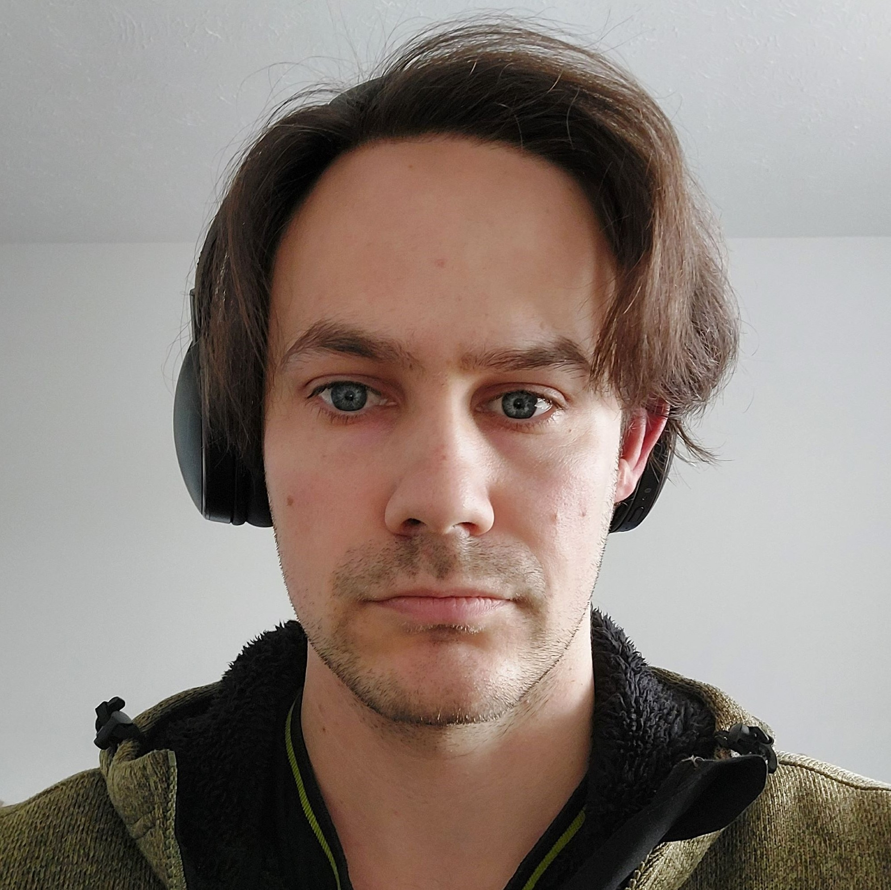

```{r setup, include=FALSE}
knitr::opts_chunk$set(echo = TRUE)
```

### Stay up to date with the Lifespan Cognitive Dynamics Lab

---------------------------

## New Post-doc
Welcome to the lab Sam Parsons!

Read more about Sam:

"I am interested in examining the measurement properties of longitudinal brain imaging data. I am using and extending intra-class effect decomposition (ICED) models to assess multiple sources of error. Leveraging this information should inform our understanding of which indices are reliable, where in the brain, and how to incorporate these sources of error into our models and understanding. I am committed to supporting other researchers in their own explorations of reliability by disseminating tutorials of these methodologies. I’m also invested in open scholarship and co-founded both the ReproducibiliTea Journal Club initiative and a Framework for Open and Reproducible Research Training (FORRT)."

<aside>

```{r, layout = "l-body-ouset", fig.width=3, echo=FALSE}



```

</aside>