```{r setup, include=FALSE}
knitr::opts_chunk$set(echo = TRUE)
```

```{r, out.width = "100%", fig.align = 'center', echo=FALSE}

knitr::include_graphics("images/people/The_Lab3.jpg")

```

---

```{r, out.width = "40%", fig.align = 'center', echo=FALSE}

knitr::include_graphics("images/people/rogierkievit_C.png")

```

## ROGIER KIEVIT
Principal Investigator

<i class="fab fa-twitter"></i>[  @rogierK](https://twitter.com/rogierK)
<i class="fas fa-envelope"></i>[  rogier.kievit@radboudumc.nl](rogier.kievit@radboudumc.nl)
<i class="ai ai-google-scholar"></i>[  google scholar](https://scholar.google.com/citations?user=kplx7AUAAAAJ&hl=en)
<i class="ai ai-orcid"></i>[  ORCID](https://orcid.org/0000-0003-0700-4568)


Rogier Kievit is Professor of Developmental Neuroscience at the Donders Institute in Nijmegen and Senior Associate Scientist at the Cognition and Brain Sciences Unit, University of Cambridge. He studies the rise and fall of cognitive functions across the lifespan by relating brain function, brain structure and cognition in developing populations using multivariate modeling techniques. Specifically, I use a variety of structural equation models to capture the changing relationship between mind and brain across the lifespan. CV


---

```{r, out.width = "40%", fig.align = 'center', echo=FALSE}

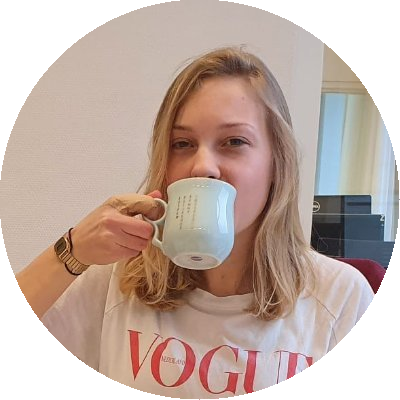

```


## JESSICA SCHAAF

Postdoctoral researcher

<i class="fab fa-twitter"></i>[  @JessicaVSchaaf](https://twitter.com/JessicaVSchaaf)
<i class="fas fa-envelope"></i>[  jessica.schaaf@radboudumc.nl](jessica.schaaf@radboudumc.nl)
<i class="ai ai-google-scholar"></i>[  google scholar](https://scholar.google.com/citations?user=Yse3MpEAAAAJ&hl=nl)
<i class="ai ai-orcid"></i>[  ORCID](https://orcid.org/0000-0002-4856-9592)


I’m interested in how cognitive abilities develop across age and specifically in how we can use computational models to understand this development. I see it as a scientist’s duty to expand our common knowledge about the world and its inhabitants. As such, I like to challenge myself in communicating scientific findings to society in an understandable way. When I’m out of office, you can find me at the tennis court or at home cuddling with the sweetest cat in the world.

---

```{r, out.width = "40%", fig.align = 'center', echo=FALSE}

knitr::include_graphics("images/people/nickjudd_C.png")

```


## NICHOLAS JUDD

Postdoctoral researcher/data scientist

<i class="fab fa-twitter"></i>[  @nickkjudd](https://twitter.com/nickkjudd)
<i class="fas fa-envelope"></i>[  nicholas.judd@radboudumc.nl](nicholas.judd@radboudumc.nl)
<i class="ai ai-google-scholar"></i>[  google scholar](https://scholar.google.com/citations?user=Hx6n8aEAAAAJ&hl=en)
<i class="ai ai-orcid"></i>[  ORCID](https://orcid.org/0000-0002-0196-9871)


I'm interested in how complex cognition arises. Specifically, how we solve problems, adapt, and respond to ever-changing demands. This has led me to focus on the domains of fluid reasoning and working memory. Recently, my research has examined how genetics and socioeconomics affect the development of these skills. I use a variety of methods depending on the question at hand, this ranges from observational datasets, RCTs, and causal inference techniques. Here I will be looking to see if it is possible to unravel the influences of global and local structural MR metrics on cognition. In my free time, I love to surf, rock climb, and travel (when possible)!

---

```{r, out.width = "40%", fig.align = 'center', echo=FALSE}

knitr::include_graphics("images/people/leamichel_C.png")
```

## LÉA MICHEL

PhD student

<i class="fab fa-twitter"></i>[  @LeaCMichel](https://twitter.com/LeaCMichel)
<i class="fas fa-envelope"></i>[  lea.michel@radboudumc.nl](lea.michel@radboudumc.nl)
<i class="ai ai-google-scholar"></i>[  google scholar](https://scholar.google.com/citations?user=YazsGkMAAAAJ&hl=fr&oi=ao)
<i class="ai ai-orcid"></i>[  ORCID](https://orcid.org/0000-0003-1529-573X)


I am interested in the impact of genetics and the environment on children’s development. In particular, during this PhD, I will study how brain maturation (looking at white matter microstructure and grey matter morphology) underlies the development of cognitive ability in childhood. Before this PhD, I completed my master’s degree in cognitive science in Paris with a major in neuroscience. I also had the opportunity to do a gap year during my master training, visiting several labs abroad to train in neuroimaging analyses. In my spare time, I am the vice president of the French association Fédération Fresco and I am especially engaged in our project to create seven cognitive science forums in France in order to popularize cognitive science.

---

```{r, out.width = "50%", fig.align = 'center', echo=FALSE}

knitr::include_graphics("images/people/Jordy_van_Langen_C.png")
```

## JORDY VAN LANGEN

PhD student

<i class="fab fa-twitter"></i>[  @jordyvanlangen](https://twitter.com/jordyvanlangen)
<i class="fas fa-envelope"></i>[  jordy.vanlangen@radboudumc.nl](jordy.vanlangen@radboudumc.nl)
<i class="ai ai-google-scholar"></i>[  google scholar](https://scholar.google.com/citations?user=gsSpOgkAAAAJ&hl=nl&oi=ao)
<i class="ai ai-orcid"></i>[  ORCID](https://orcid.org/0000-0003-2504-2381)
<i class="fa fa-github"></i>[  GitHub](https://github.com/jorvlan)
<i class="fab fa-mastodon"></i>[  Mastodon](https://mas.to/@jordyvanlangen)

I am interested in developing novel open science tools for the wider academic community. In that perspective, I have been part of the LCD lab in 2022 developing our data visualization framework called: raincloudplots. Also, I am interested in advancing the field of cognitive neuroscience through my research. Within the CODEC study, I am studying cognitive variability in early childhood. Specifically, we aim to measure, model, and mechanistically understand the nature of cognitive variability differences within and between children. We will use the temporal precision of experience sampling methods, the richness of a cohort study, and the prospective and developmental power of accelerated 
longitudinal designs. Together this will hopefully provide new insight into the construct of cognitive variability. In my free time, I love to run, lift weights, play and watch tennis, read novels, or search for unique vintage items. 

---

```{r, out.width = "50%", fig.align = 'center', echo=FALSE}

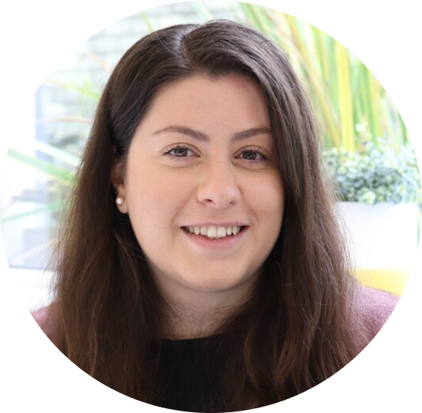
```

## ELENI ZIMIANITI

PhD student

<i class="fas fa-envelope"></i>[  eleni.zimianiti@mpi.nl](eleni.zimianiti@mpi.nl)

I am interested in understanding how humans differ in their language use, and more specifically how language and children’s individual differences are at play in language acquisition over development. To this end, I aim to investigate how children manage to acquire language at similar levels across time, what makes some children faster than other in language learning and how children differ with their past-selves over development. In my free time, I like baking, doing yoga, and travelling!

---

```{r, out.width = "50%", fig.align = 'center', echo=FALSE}

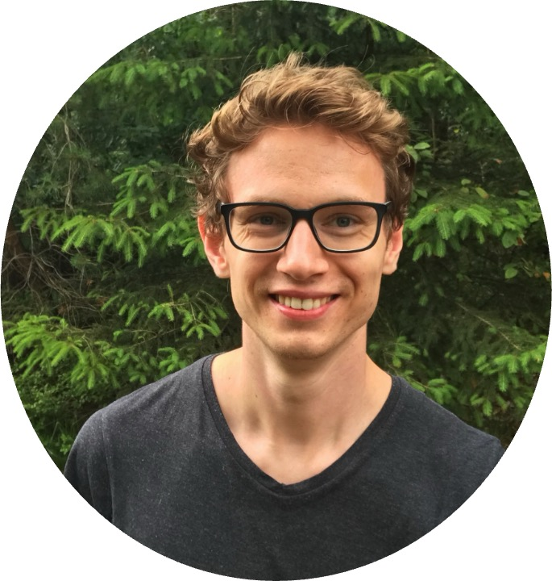
```

## BOB KAPTEIJNS

PhD Student

<i class="fas fa-envelope"></i>[Bob.Kapteijns@ru.nl](Bob.Kapteijns@ru.nl)
<i class="ai ai-google-scholar"></i>[  google scholar](https://scholar.google.nl/citations?user=__55KLYAAAAJ)
<i class="ai ai-orcid"></i>[  ORCID](https://orcid.org/0000-0003-3019-8006)


I’m a PhD student at the Behavioural Science Institute (BSI) at Radboud University, and an external member of the Lifespan Cognitive Dynamics Lab. I’m conducting a 5-wave longitudinal study, called the Radboud Early Academic Development Inquiry (the READI project, in short). In this project, we investigate children’s early cognitive, literacy and numeracy development throughout the earliest years of primary school. Specifically, I’m interested in learning more about the cognitive and home-related factors that are associated with individual differences in children’s reading and math development across early primary school. Next to this project, I’m also working on a project featuring diffusion-weighted MRI data, where we aim to investigate the relationships between cortical white matter, executive skills and early reading and math abilities in a large, atypical youth sample.

---

```{r, out.width = "40%", fig.align = 'center', echo=FALSE}

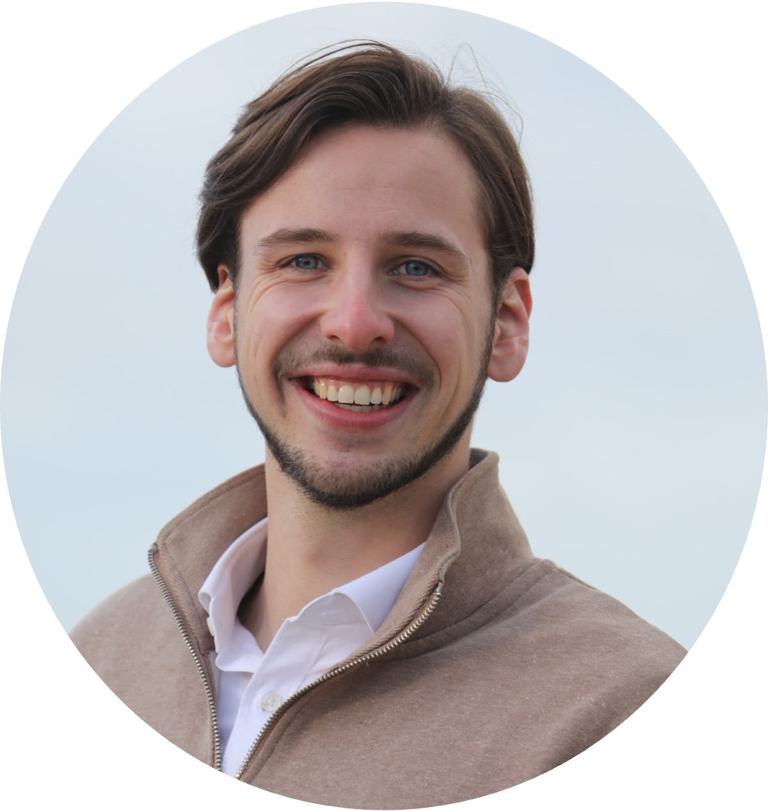
```

## Ciske Jansen

Lab Manager

<i class="fab fa-linkedin-in"></i>[ LinkedIn](https://nl.linkedin.com/in/ciske-jansen-54747a132)
<i class="fas fa-envelope"></i>[ciske.jansen@radboudumc.nl](aran.vanhout@radboudumc.nl)

I am interested in development and how the early plastic stages of life lay the foundation for cognition, behavior, and language. With a background in medical neurobiology and developmental research, I have experience with a wide range of methods used to study these processes. I am particularly drawn to longitudinal projects that explore the long-term impacts of early development. At the LCD Lab, my focus is on organizing and maintaining lab structures while contributing wherever needed. Additionally, I am a Research Assistant at the Developmental Psychobiology Lab. Outside of research, I enjoy endurance sports. Mostly running, but I also love cycling on sunny days, swimming in a warm pool when it's cold outside and hiking on holidays!


---

```{r, out.width = "40%", fig.align = 'center', echo=FALSE}

knitr::include_graphics("images/people/Emma_C.png")
```

## EMMA MEEUSSEN

Research assistant

<i class="fab fa-linkedin-in"></i>[ LinkedIn](https://www.linkedin.com/in/emma-meeussen/)
<i class="fas fa-envelope"></i>[  emma.meeussen@radboudumc.nl](emma.meeussen@radboudumc.nl)

I am interested in human cognitive development, its variation, and the ways in which we can best support it in order to thrive as human beings. I believe that to optimally do so, it’s essential that we understand the processes underlying both impaired and healthy development. Besides the LCD group, I also work as a haptotherapist, where I put theory into practice by using touch to help clients gain insight into their own development and stimulate its natural flow. In my spare time I enjoy reading (anything from romcom novels to ancient spiritual texts), making music and the freedom of being in nature, especially in summer when I get to cycle around the country for (mini) camping trips.

---

```{r, out.width = "40%", fig.align = 'center', echo=FALSE}

knitr::include_graphics("images/people/Felinevanaagten_C.png")
```

## FELINE VAN AAGTEN

Research assistant

<i class="fab fa-linkedin-in"></i>[ LinkedIn](https://www.linkedin.com/in/feline-van-aagten/)
<i class="fas fa-envelope"></i>[  feline.vanaagten@radboudumc.nl](feline.vanaagten@radboudumc.nl)

I'm interested in differences in development of children with and without diagnoses. In my previous research I focused specifically on the neurobiological substrates of ADHD by means of diffusion tensor imaging. Currently, I'm contributing to the CODEC project, a new longitudinal project focused on the fluctuation in preschoolers. In my downtime I like to play golf and cook new recipes. My absolute favorite activity is snowboarding.

---

```{r, out.width = "40%", fig.align = 'center', echo=FALSE}

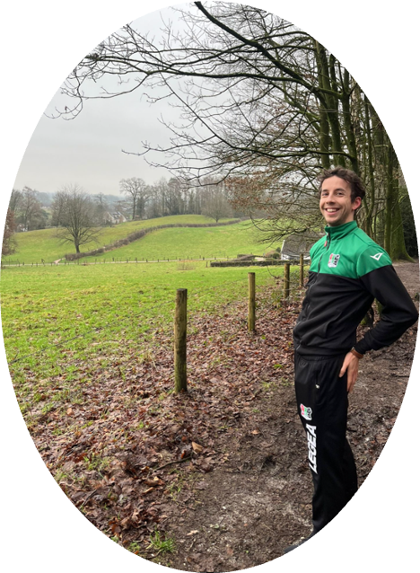
```

## ARAN VAN HOUT

Research assistant

<i class="fas fa-envelope"></i>[aran.vanhout@radboudumc.nl](aran.vanhout@radboudumc.nl)

Hi, I’m Aran! I work as a research assistant on the OMSS project, where I’m developing a program to generate matrices for assessing fluid reasoning. You can learn more about this research [here](https://www.aranvanhout.com/research.html).
I’m also involved in organizing REMAC, a program that connects researchers at Radboud University who use Ecological Momentary Assessment.

---

```{r, out.width = "40%", fig.align = 'center', echo=FALSE}

knitr::include_graphics("images/people/EricFleischer_C.png")
```

## ERIC FLEISCHER

Research assistant

<i class="fab fa-linkedin-in"></i>[ LinkedIn]( https://nl.linkedin.com/in/eric-fleischer-468a291b8?trk=people-guest_people_search-card)
<i class="fas fa-envelope"></i>[eric.fleischer@radboudumc.nl](eric.fleischer@radboudumc.nl)

My interest lies in the field of developmental psychology. Within this area I am especially interested in the development of mental disorders in the (early) lifetime of an individual. Next to being a research assistant for the CODEC-project, I am working as a child and youth psychologist (so to speak the perfect combination between theory/research and practice). In my spare time I like to run or cycle, watch a movie at the cinema and train my cooking skills.

---

```{r, out.width = "50%", fig.align = 'center', echo=FALSE}

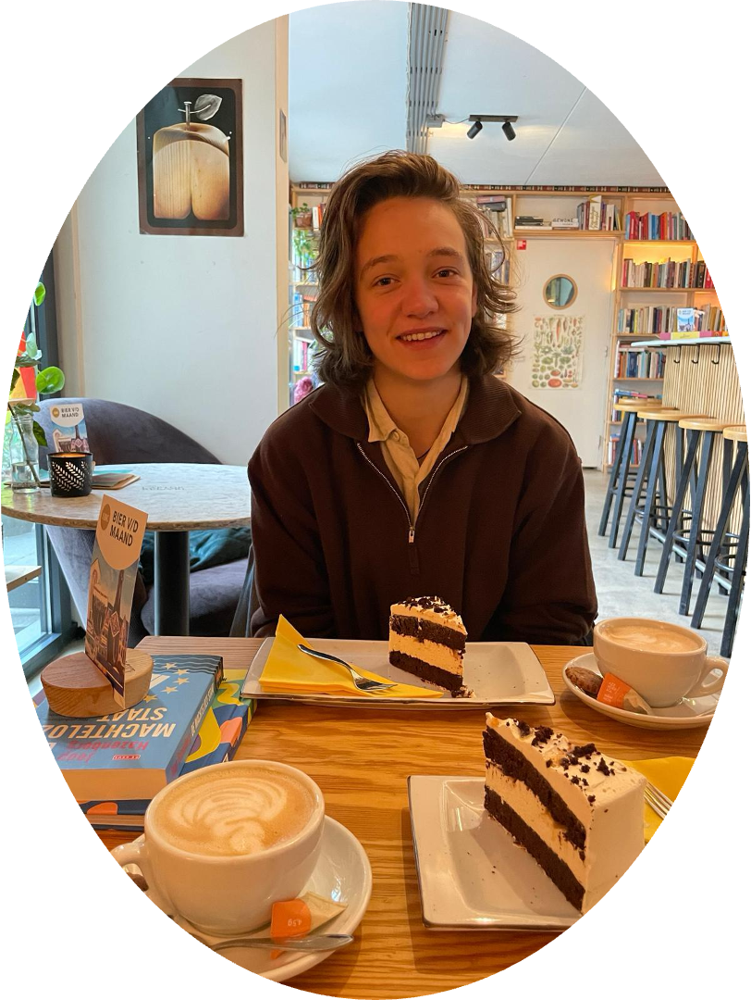
```

## Aline Korver

Intern

I am a research master’s student in Cognitive Neuroscience with a double background in Psychology and Philosophy, interested in the development of alternative research methods which respect the complex, dynamic, and individually unique nature of psychological phenomena. For my internship, I will be involved in the CODEC project, which studies cognitive variability in early childhood. In my free time, I enjoy reading novels, running over the Veluwe, and commuting between Arnhem and Nijmegen with my racing bike!

---

```{r, out.width = "50%", fig.align = 'center', echo=FALSE}

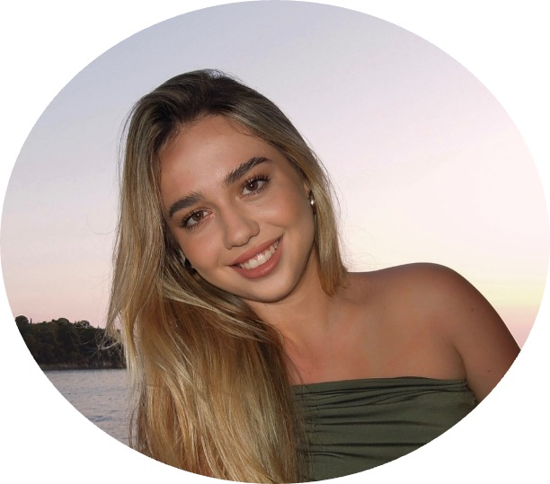
```

## EMA JOVANOVIC

Intern

<i class="fas fa-envelope"></i>[ema.jovanovic@radboudumc.nl](ema.jovanovic@radboudumc.nl)

I am currently pursuing a Master’s degree in Medical Biology at Radboud University, with a specialization in Neurobiology. My main research interest lies in the relationship between neurodevelopmental disorders—particularly depression—and cognitive processes. My current research project at LCD explores how mood variability correlates with cognition, and which specific cognitive domains are most affected. The idea behind this is to understand whether standard cognitive assessments accurately reflect abilities when mood states vary. For example, is it appropriate to test individuals on cognitive tasks when their mood may significantly impact their performance and potentially skew the results? I completed my Bachelor’s degree at the University of Toronto, where I specialized in Pharmacology, Immunology, and Physiology. In the future, I hope to integrate my background in neuroscience and pharmacology to better understand how pharmacological interventions might target cognitive deficits associated with mood disorders. Aside from my studies, in my free time I like to travel and try new foods!

---

```{r, out.width = "40%", fig.align = 'center', echo=FALSE}

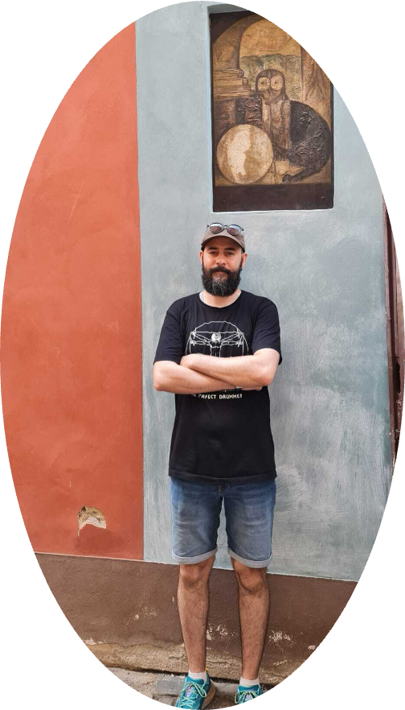
```

## AFON KHARI

Intern

I am a second-year master's student in Brain and Cognitive Sciences at the University of Amsterdam, currently joining the Lifespan Cognitive Dynamics Lab as a research intern. I am interested in attention, learning, mind wandering, and cognitive strategies, particularly in the context of cognitive variability.
My focus is on how cognitive strategies and attention fluctuations relate to performance on tasks. Additionally, I am interested in Dynamic Structural Equation Modeling (DSEM) as a tool to quantify these fluctuations over time.
Beyond research, I enjoy reading about cognitive science, watching movies, and hiking. I am excited to be part of the lab and look forward to collaborating on projects that deepen our understanding of cognitive development and variability!

---

```{r, out.width = "40%", fig.align = 'center', echo=FALSE}

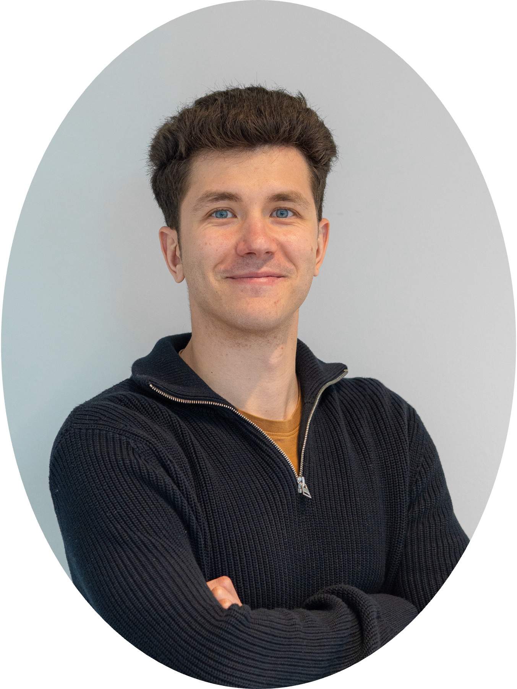
```


## Fer

I’m fascinated by how cognitive abilities develop over time; especially how, within a stable environment, we can foster sustainable cognitive growth. My current work focuses on assessing the reliability of behavioral tasks, examining the use of well-established paradigms such as the Stroop and Go/NoGo tasks for measuring interindividual differences.
Outside the lab, I enjoy cooking, spending time in nature, exercising, and meditating. I’m also an avid podcast listener, especially on topics like consciousness, personal development, and parenting.

---


# Lab Alumni

--- 


```{r, out.width = "40%", fig.align = 'center', echo=FALSE}

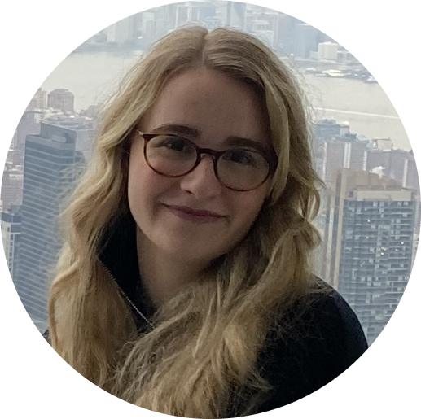
```

## CAROLINE WUNN

Intern

<i class="fab fa-linkedin-in"></i>[ LinkedIn](https://www.linkedin.com/in/caroline-wunn-59090120a/)
<i class="fas fa-envelope"></i>[caroline.wunn@ru.nl](caroline.wunn@ru.nl)

I am interested in studying brain development in children and adolescents, particularly how emotional, educational, and social factors influence cognitive abilities and mental health. Currently, I am pursuing a research master's in Cognitive Neuroscience with a specialization in Perception, Action, and Decision-Making. My current research project focuses on the influence of schooling on working memory performance, using fMRI and the N-back task. Outside of my studies, I enjoy reading and travelling.

---

```{r, out.width = "40%", fig.align = 'center', echo=FALSE}

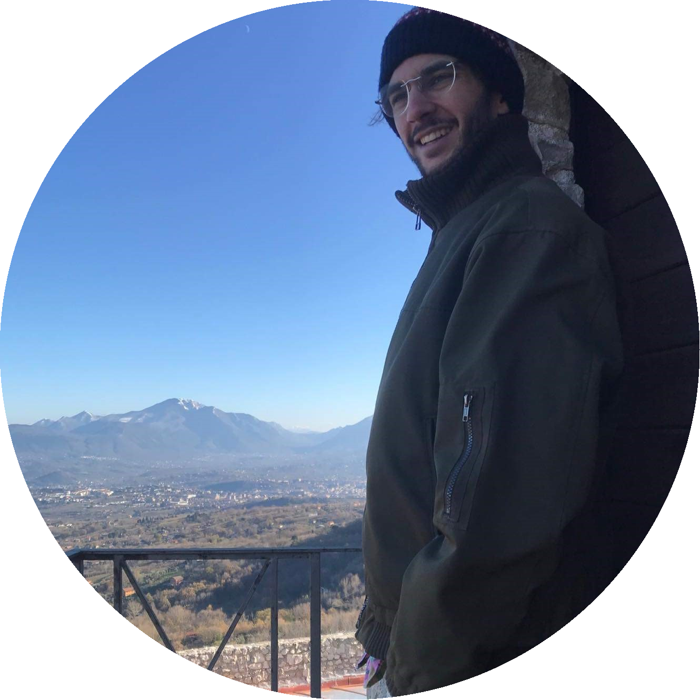

```

## MICHAEL ARISTODEMOU

PhD student

<i class="fab fa-twitter"></i>[  @mearistodemou](https://twitter.com/mearistodemou)
<i class="fas fa-envelope"></i>[  michael.aristodemou@radboudumc.nl](michael.aristodemou@radboudumc.nl)
<i class="ai ai-google-scholar"></i>[  google scholar](https://scholar.google.com/citations?user=AXBd2n4AAAAJ&hl=en)
<i class="ai ai-orcid"></i>[  ORCID](https://orcid.org/0000-0003-0420-2702)


I want to understand how and why people’s cognitive abilities fluctuate and change over time. To this end, I aim to exploit technological advances that allow us to observe cognitive development as it unfolds in conjunction with different modeling approaches. Ultimately, I strive to use knowledge about the mechanisms underlying cognitive development to benefit the evolution of educational and cognitive interventions.

---

```{r, out.width = "40%", fig.align = 'center', echo=FALSE}

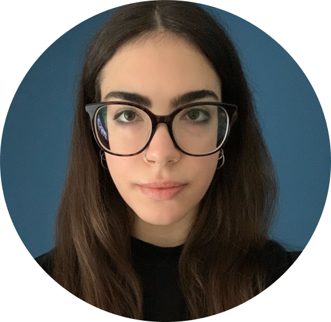
```

## MAGDA LAZARI

Intern

<i class="fab fa-linkedin-in"></i>[ LinkedIn](https://www.linkedin.com/in/magdalini-lazari-baab35348/)

I am visiting the lab as part of the Erasmus+ program after recently completing my degree in psychology. During my stay, I’ll be learning and applying statistical modeling to analyze developmental cognitive data, with a focus on the mutualism theory in cognitive development. In my free time, I enjoy climbing and reading.

---


```{r, out.width = "40%", fig.align = 'center', echo=FALSE}

knitr::include_graphics("images/people/Ilse_Coolen_C.png")

```

## Ilse Coolen


Postdoctoral Researcher

<i class="fab fa-twitter"></i>[  @CoolenIlse](https://twitter.com/CoolenIlse)
<i class="fas fa-envelope"></i>[  ilse.coolen@radboudumc.nl](ilse.coolen@radboudumc.nl)
<i class="ai ai-google-scholar"></i>[  google scholar](https://scholar.google.com/citations?hl=en&user=e0K_sngAAAAJ)
<i class="ai ai-orcid"></i>[  ORCID](https://orcid.org/0000-0003-2254-7851)


I am interested in the development of cognitive skills and how they relate to academic achievement. My main research is focused on the contributions of cognitive skills during the development of mathematics in preschoolers and early primary school children. I have mainly used observational, longitudinal research designs to follow the child’s development and have recently added MRI components to my research to link behavioural and neuroimaging data. I have also been invested as part of the trainee board of the Mathematical Cognition and Learning Society. Outside of work you can usually find me surrounded by cats, either my own or any other cat.

---

```{r, out.width = "40%", fig.align = 'center', echo=FALSE}

knitr::include_graphics("images/people/Sophie_C.png")
```

## Sophie Hofman

Research / student assistant

<i class="fas fa-envelope"></i>[  sophie.hofman@radboudumc.nl](sophie.hofman@radboudumc.nl)

I am very interested in the development and cognitive aspect that regulates human behaviour, hence why i am currently doing my masters in Behavioural Science at the Radboud University. I also enjoy converting (neuro)science into fun and understandable lessons/communication tools to teach e.g. children and adolescents about the brain and the possibilities of science. In my spare time I’m enjoying playing hockey and discovering new cities abroad!

---

```{r, out.width = "40%", fig.align = 'center', echo=FALSE}

knitr::include_graphics("images/people/Liza_C.png")
```

## Liza Rozman

Intern

<i class="fas fa-envelope"></i>[  Liza.rozman@ru.nl](Liza.rozman@ru.nl)
<i class="fab fa-linkedin-in"></i>[ LinkedIn](www.linkedin.com/in/lizarozman)

I am a student of the research Master in Cognitive Neuroscience with a specialisation in Plasticity and Lifelong Development. My main interests lie in neurodevelopmental disorders, specifically ADHD, as well as sleep and sleep related disorder. For my Master's thesis I will investigate if and how ADHD symptoms and sleep disturbances are connected, their variability over time, and if there are any neural structures driving this relationship. Outside of academics, I am an avid enjoyer of naps, watching TV and going to the gym.

---

```{r, out.width = "40%", fig.align = 'center', echo=FALSE}

knitr::include_graphics("images/people/Nebbe_C.png")
```

## Nebbe Al-Moula

Intern

<i class="fas fa-envelope"></i>[  nebbe.al-moula@ru.nl](nebbe.al-moula@ru.nl )
<i class="fab fa-linkedin-in"></i>[ LinkedIn](https://www.linkedin.com/in/nebbe-al-moula-6b6789227)

I am interested in plasticity in the brain and the differences between typical and atypical development. I am a student of the MSc Cognitive Neuroscience program. For my Master’s thesis, I will be looking into structural differences in White and Gray matter in individuals with ASD. With this research I hope to delve further into the relationship between structural differences in the brain and common characteristics of ASD. Outside of academic activities I enjoy weightlifting and can often be found in the gym.

---

```{r, out.width = "40%", fig.align = 'center', echo=FALSE}

knitr::include_graphics("images/people/Ben_Kretzler_C.png")
```

## Ben Kretzler

Intern

<i class="fas fa-envelope"></i>[  ben.kretzler@ru.nl](ben.kretzler@ru.nl)

I am interested in the mechanisms underlying cognitive variability, and the development of cognitive skills. For my master’s thesis, I plan to employ complexity methods to gain a fresh perspective on mental illnesses. My focus will be on analyzing time series data related to patients’ cognitive performance. The goal is to identify suitable models that can classify patients based on the structure of their system noise. Outside the workplace, I like running, reading, hiking, and watching puppy videos.


---

```{r, out.width = "40%", fig.align = 'center', echo=FALSE}

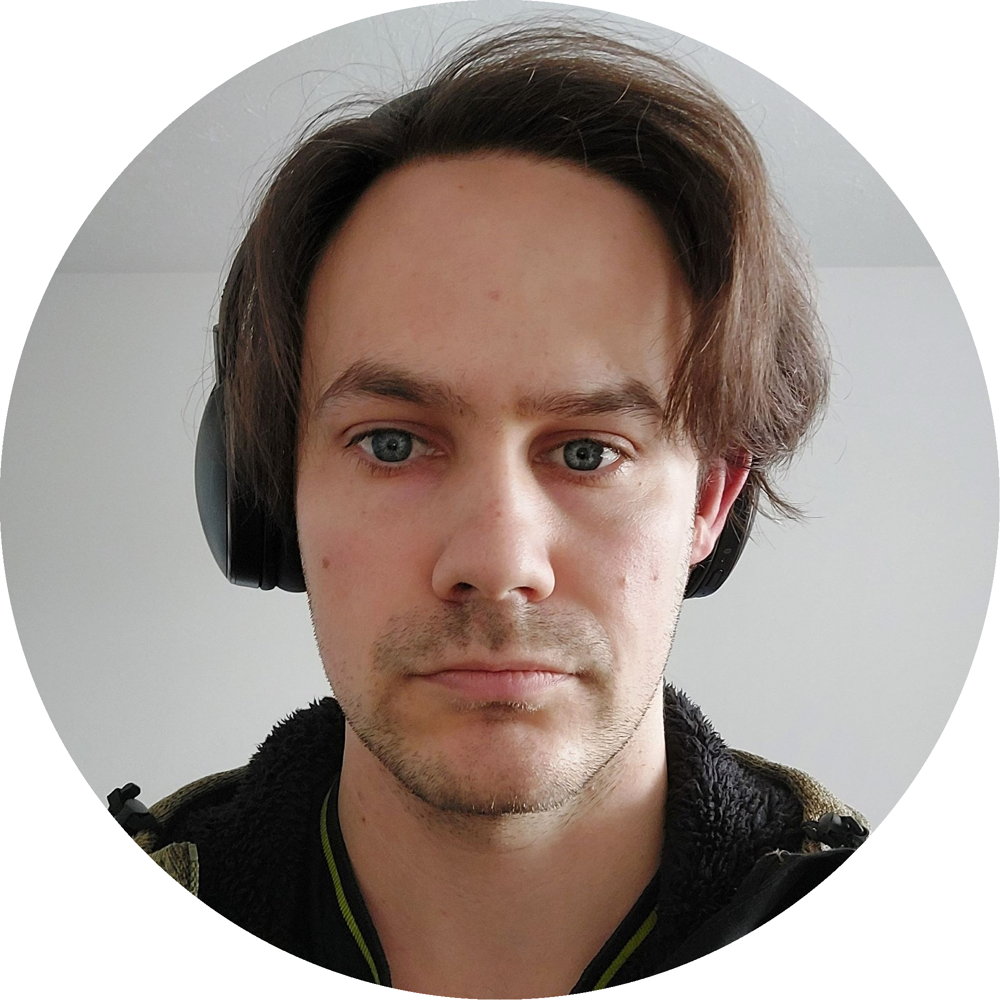

```

## SAM PARSONS

Postdoctoral Researcher

<i class="fab fa-twitter"></i>[  @Sam_D_Parsons](https://twitter.com/Sam_D_Parsons)
<i class="fas fa-envelope"></i>[  sam.parsons@radboudumc.nl](sam.parsons@radboudumc.nl)
<i class="ai ai-google-scholar"></i>[  google scholar](https://scholar.google.com/citations?user=kE37Xy4AAAAJ&hl=en)
<i class="ai ai-orcid"></i>[  ORCID](https://orcid.org/0000-0002-7048-4093)


I am interested in examining the measurement properties of longitudinal brain imaging data. I am using and extending intra-class effect decomposition (ICED) models to assess multiple sources of error. Leveraging this information should inform our understanding of which indices are reliable, where in the brain, and how to incorporate these sources of error into our models and understanding. I am committed to supporting other researchers in their own explorations of reliability by disseminating tutorials of these methodologies. I’m also invested in open scholarship and co-founded both the ReproducibiliTea Journal Club initiative and a Framework for Open and Reproducible Research Training (FORRT).

---

```{r, out.width = "40%", fig.align = 'center', echo=FALSE}

knitr::include_graphics("images/people/ethanmccormick_C.png")
```

## ETHAN McCORMICK

<i class="fab fa-twitter"></i>[  @E_M_McCormick](https://twitter.com/E_M_McCormick)

I am interested in the measurement and modeling of data over time using advanced intensive and long-term longitudinal designs. In particular, my current work seeks to link short-term changes due to learning/reactivity with long-term changes due to retest and development to understand how behavior and cognition unfold across multiple timescales. Additionally, I have a strong commitment to the dissemination of quantitative methods, especially in the behavioral and cognitive neurosciences. Outside of the lab, I enjoy running, wrangling Waldorf and Statler (link to https://quantitudepod.org/), and dreaming of traveling again sometime this decade.

---

```{r, out.width = "40%", fig.align = 'center', echo=FALSE}

knitr::include_graphics("images/people/sophiaborgeest_C.png")
```

## SOPHIA BORGEEST

PhD student

<i class="fab fa-twitter"></i>[  @gsborgeest](https://twitter.com/gsborgeest)

I am interested in healthy aging, and especially in why some people seem to age much better (or more successfully) than others. In my first project, I used psychometric techniques in a large-sample, multimodal dataset to further understand the associations between leading an active lifestyle and cognitive health. Currently, I am exploring how we can better measure brain structure throughout the lifespan. Here, I am looking at detailed structural MR imaging metrics that might allow for a biologically more accurate picture of the human brain, hopefully allowing us to better describe and quantify healthy neural aging. I like engaging the public and writing for popular audiences. I wish there were more women in leadership and that Cambridge were closer to the mountains.

---

```{r, out.width = "40%", fig.align = 'center', echo=FALSE}

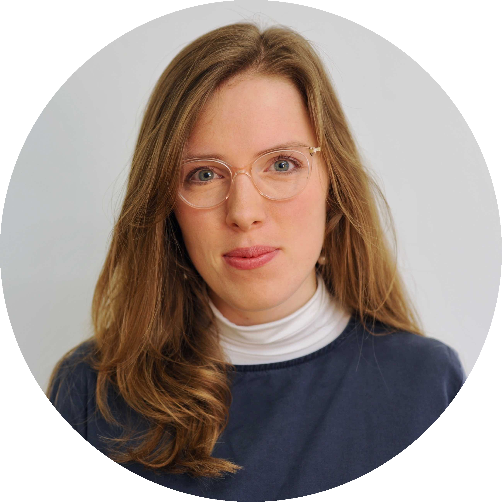
```

## Amy Orben

<i class="fab fa-twitter"></i>[  @OrbenAmy](https://twitter.com/OrbenAmy)

Amy studies how the use of social media and digital technology influences adolescent mental health. Her current work uses statistical modeling methods and large-scale data to address questions debated in policy, parenting and mental health. Amy currently leads the Digital Mental Health Group at the University of Cambridge. You can read more about Amy's work here.

---

```{r, out.width = "40%", fig.align = 'center', echo=FALSE}

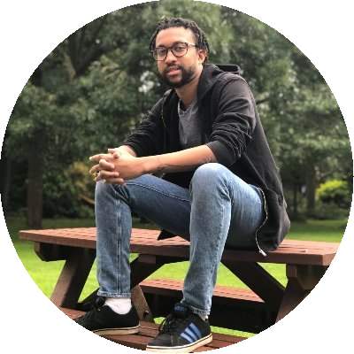
```

## Ivan Simpson-Kent

<i class="fab fa-twitter"></i>[  @IvanSimpsonKent](https://twitter.com/IvanSimpsonKent)

Ivan Simpson-Kent completed his PhD at the LCD lab. His dissertation examined how brain and behavior interact with each other during development to produce intelligence, particularly in childhood and adolescence. Ivan is currently a postdoc at the University of Pennsylvania studying how the environment influences cognition and brain development. You can follow Ivan here.

---

```{r, out.width = "40%", fig.align = 'center', echo=FALSE}

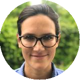
```

## Delia Fuhrmann

<i class="fab fa-twitter"></i>[  @DeliaFuhrmann](https://twitter.com/DeliaFuhrmann)

Delia works on lifespan development and plasticity.  Her current research focus is executive functions, such as reasoning and working memory, and their neural substrates using mostly large, publicly available data-sets and multivariate statistical tools like Structural Equation Modelling. Delia is  presently a lecturer at King's College London. You can read more about Delia’s work here.

---

```{r, out.width = "40%", fig.align = 'center', echo=FALSE}

knitr::include_graphics("images/people/erikvankesteren_C.png")
```

## Eric-Jan Van Kesteren

<i class="fab fa-twitter"></i>[  @ejvankesteren](https://twitter.com/ejvankesteren)

Erik-Jan visited the lab in 2019 to improve exploratory factor analysis for structural brain imaging data. Specifically, he developed and tested methods for taking into account brain symmetry when extracting factors, as asymmetry in the brain may be of interest in development. He is currently assistant professor at Utrecht University. You can read more about him here.

---

```{r, out.width = "40%", fig.align = 'center', echo=FALSE}

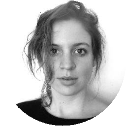
```

## Marie Deserno

<i class="fab fa-twitter"></i>[  @MarieDeserno](https://twitter.com/MarieDeserno)

Marie Deserno visited the lab in 2018 to work on longitudinal developmental dynamics in children at risk for autism. She used latent growth curve models to study the interplay between motor and language development in early childhood. She is currently a Rubicon Fellow at the Max Planck Centre for Human Development in Berlin. You can read about her current work here.

---

```{r, out.width = "40%", fig.align = 'center', echo=FALSE}

knitr::include_graphics("images/people/susannedemooij_C.png")
```

## Susanne de Mooij

<i class="fab fa-twitter"></i>[  @SusanneMooij](https://twitter.com/SusanneMooij)

Susanne de Mooij visited the lab in 2016 to work in psychometric approaches to aging. She implemented CFA SEM trees to study neural and cognitive age differentiation in the Cam-CAN sample. Her paper on this work can be found here. She is currently working on her PhD in a shared project between Birkbeck and the University of Amsterdam, working on educational games using psychometric techniques, eye tracking and adaptive learning.
