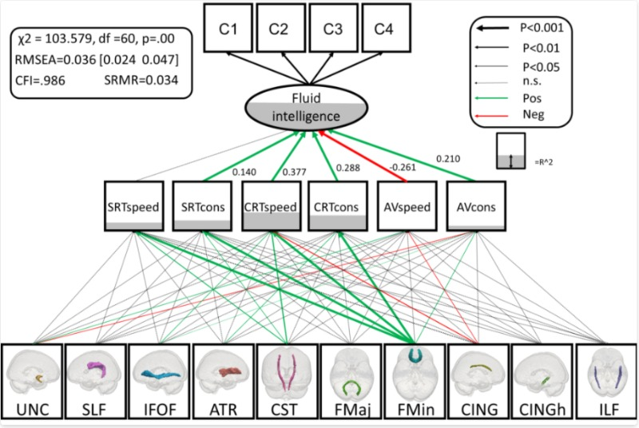

```{r setup, include=FALSE}
knitr::opts_chunk$set(echo = TRUE)
```


## Cognitive variability

Human performance differs cross many dimensions – some can read, do mathematics, paint and ride a bicycle better than others. However, an often neglected aspect of performance is fluctuation, or variability: However good or bad you are at something, your own performance will go up and down over time. Unlikely computers, our execution of cognitive tasks varies with each repetition. Sometimes this might be a good thing: variability might reflect us exploring the space of possible solutions to a problem. At other times, variability reflects a lack of focus, becoming easily distracted, or bored over time. The degree to which people fluctuate in their cognitive performance is a central area of ongoing research at the LCD lab. Using technological innovations such as tablet-based tasks and new quantitative modelling techniques, we hope to better understand the causes and consequences of ups and downs of human cognitive performance.

<aside>

```{r, layout = "l-body-ouset", fig.width=3, echo=FALSE}

knitr::include_graphics("images/pages/variability.png")

```

</aside>


## COGNITIVE DYNAMICS


A striking feature of individual differences in cognitive abilities is that they are universally positively correlated – a phenomenon known as the positive manifold. The traditional method of analysis yields a g-factor, a single summary metric with considerable predictive power. However, this summary metric ignores the developmental origin of the positive manifold. Multiple competing accounts of the origin of the g factor have been proposed, but in the absence of tailored longitudinal data these models cannot be empirically distinguished. One such model, the [mutualism](https://pubmed.ncbi.nlm.nih.gov/17014305/) model, proposes that positive interactions between cognitive domains facilitate mutual growth. In three ([1](https://journals.sagepub.com/doi/full/10.1177/0956797617710785), [2](https://osf.io/3g9vx), [3](https://osf.io/gcdw3/)) different projects we have shown that this model can help explain cognitive development in childhood. We are currently working on various extensions of these findings.

<aside>

```{r, layout = "l-body-ouset", fig.width=3, echo=FALSE}

knitr::include_graphics("images/pages/1-s2.0-S187892931730021X-gr4.jpg")

```

</aside>


## MODELLING BRAIN-BEHAVIOR RELATIONSHIPS

One of the core questions in cognitive neuroscience is how brain and behaviour are related. To this end, we propose a theory-drive, multivariate statistical approach. In [previous work](https://www.tandfonline.com/doi/full/10.1080/1047840X.2011.550181) we demonstrate how theories from philosophy of mind such as identity theory and supervenience can be represented as statistical models and thus tested empirical for a given construct. Recently, we have expanded this thinking to develop a statistical implementation of the watershed model. This model presupposes that distal influences such as small genetic effects propagate through low- and intermediate level, partially independent phenotypes such as brain structure and basic cognitive abilities to affect high level constructs such as fluid reasoning. We have shown this model outperforms competing accounts in three distinct cohorts across the lifespan.

<aside>

```{r, layout = "l-body-ouset", fig.width=3, echo=FALSE}



```

</aside>

## LIFESTYLE AND ENVIRONMENTAL FACTORS

Evidence suggests that a range of environmental and social factors can impact on individual differences in cognitive abilities as well as their trajectories over time. We are interested in better understanding these factors. This includes looking at the possible impact of differences in [sleep quality, lifestyle factors](https://psyarxiv.com/6pzve/) such as intellectual and social engagement and the associations between [cardiovascular health and white matter structure](https://www.sciencedirect.com/science/article/pii/S0197458018303683).

<aside>

```{r, layout = "l-body-ouset", fig.width=3, echo=FALSE}

knitr::include_graphics("images/pages/lf.PNG.png")

```

</aside>


## MULTIVARIATE METHODS FOR LIFESPAN COGNITIVE DYNAMICS

To study lifespan changes in cognition and brain structure and function, we use multivariate methods such as Structural Equation Modeling. These models can be used to translate theoretical positions into tractable statistical models, and thus directly compared in a given dataset. Recently, we have contributed tools to develop new methods such as [regularized SEM](https://psyarxiv.com/bxzjf/), making [nice plots](https://peerj.com/preprints/27137/) and [tutorials](https://www.sciencedirect.com/science/article/pii/S187892931730021X) that make existing tools more accessible.

<aside>

```{r, layout = "l-body-ouset", fig.width=3, echo=FALSE}

knitr::include_graphics("images/pages/vektor_only.png")

```

</aside>

## LAB CULTURE

In our lab we care about doing excellent science in a collaborative environment. Maintaining a healthy work-life balance helps us do the best, most creative scientific work we can in the short and long run. Moreover, we value team science – Lab members working collaboratively to share, enrich and improve each other’s expertise and experiences. Being a complete scientist also means thinking about your expertise in a broader perspective, which benefits careers inside as well as outside of traditional academic settings. For this reason, we support lab members exploring enriching experiences such as lab visits and rotations, international collaborations and internships at academic and non-academic settings. Finally, we value principles of diversity and inclusion – Everyone should feel welcome, regardless of their background, gender or sexual orientation or any other characteristic. Better science, together.

## OPEN SCIENCE AND RESOURCES

At the lab we are guided by the principles of open science. We make all our papers available as Open Access, and often post our work as preprints. Whenever possible in the context of secondary data analysis, we preregister our analysis plans to maximize transparancy (e.g, [1](https://wellcomeopenresearch.org/articles/3-38/v2), [2](), [3](https://aspredicted.org/5pz52.pdf)). We are [research symbionts](https://researchsymbionts.org/) – We contribute to the scientific community by facilitating access to datasets, code and stimuli. For example, our work on the Cam-CAN project has already led to 600 groups from all over the world making use of our anonymized dataset, increasing the scientific value yielded from our study well beyond our own team. Additionally, we are part of international collaborations such as [Lifebrain](https://www.lifebrain.uio.no/) which bring together cohorts across Europe to maximize the scientific value and generalizability of our findings. At the same time, we benefit from amazing resources such as [Biobank](https://www.ukri.org/councils/mrc/facilities-and-resources/find-an-mrc-facility-or-resource/), [ABCD](https://abcdstudy.org/), [SHARE](https://share-eric.eu/), and [NKI-RS](http://fcon_1000.projects.nitrc.org/indi/pro/nki.html), as well as individual collaborations, to allow us to answer challenging interdisciplinary questions using the best data available. In addition to papers and data, we endeavour to share stimuli (e.g. [1](https://openpsychologydata.metajnl.com/articles/10.5334/jopd.ai/), [2](https://osf.io/uvteh/)), [slides](https://figshare.com/authors/Rogier_Kievit/571579), code (e.g. [1](https://github.com/df1234), [2](), [3](https://osf.io/z2dtq/)) and data (e.g. [1](https://camcan-archive.mrc-cbu.cam.ac.uk/dataaccess/), [2](https://osf.io/xf7rn/), [3](https://osf.io/zwk5p/files/osfstorage)) available on resources such as Figshare, the Open Science framework, Github, and preprint servers such as BioRxiv and PsyArXiv.