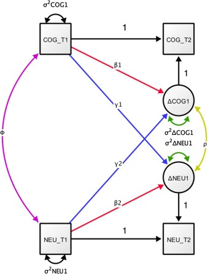
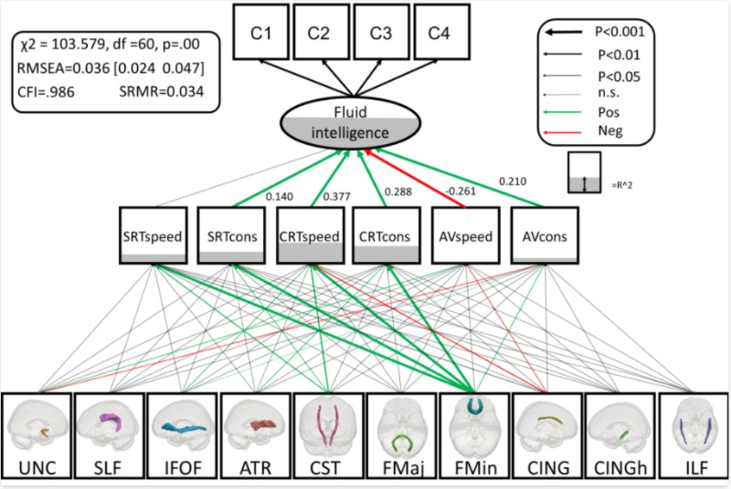
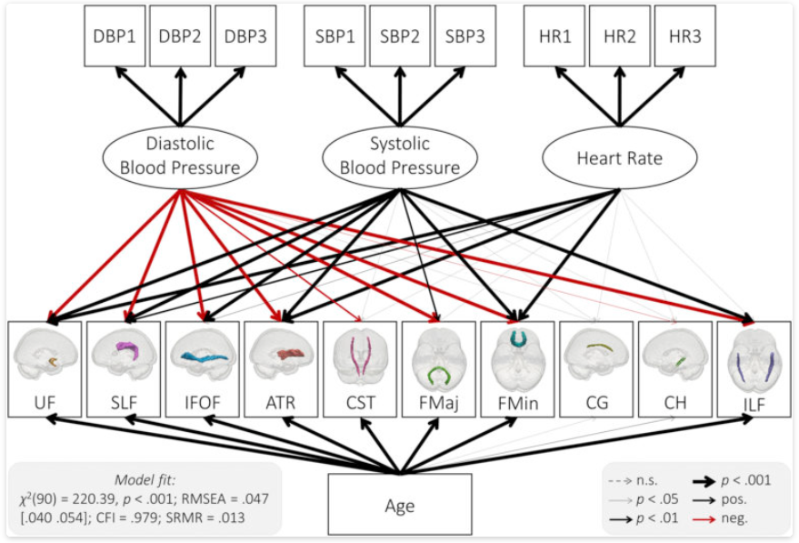
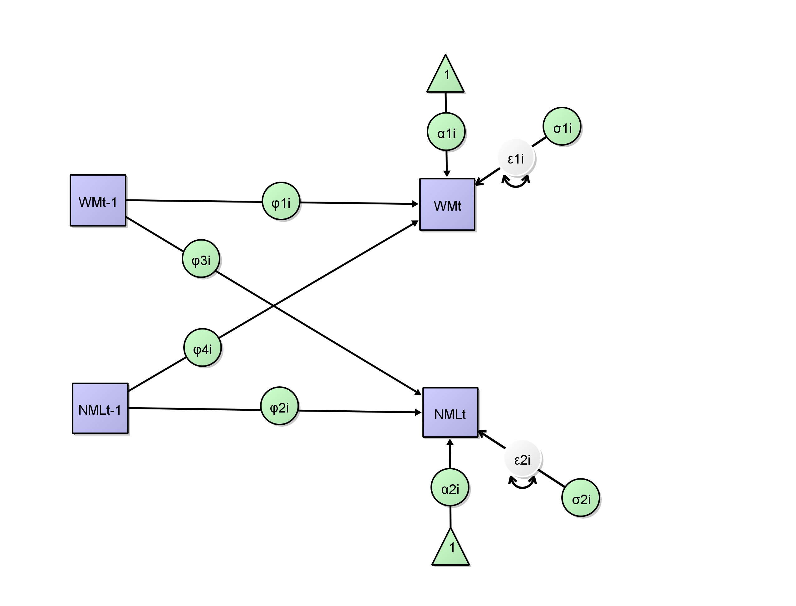

```{r setup, include=FALSE}
knitr::opts_chunk$set(echo = TRUE)
```

## COGNITIVE DYNAMICS


A striking feature of individual differences in cognitive abilities is that they are universally positively correlated – a phenomenon known as the positive manifold. The traditional method of analysis yields a g-factor, a single summary metric with considerable predictive power. However, this summary metric ignores the developmental origin of the positive manifold. Multiple competing accounts of the origin of the g factor have been proposed, but in the absence of tailored longitudinal data these models cannot be empirically distinguished. One such model, the [mutualism](https://pubmed.ncbi.nlm.nih.gov/17014305/) model, proposes that positive interactions between cognitive domains facilitate mutual growth. In three ([1](https://journals.sagepub.com/doi/full/10.1177/0956797617710785), [2](https://osf.io/3g9vx), [3](https://osf.io/gcdw3/)) different projects we have shown that this model can help explain cognitive development in childhood. We are currently working on various extensions of these findings.

<aside>

```{r, layout = "l-body-ouset", fig.width=3, echo=FALSE}



```

</aside>


## MODELLING BRAIN-BEHAVIOR RELATIONSHIPS

One of the core questions in cognitive neuroscience is how brain and behaviour are related. To this end, we propose a theory-drive, multivariate statistical approach. In [previous work](https://www.tandfonline.com/doi/full/10.1080/1047840X.2011.550181) we demonstrate how theories from philosophy of mind such as identity theory and supervenience can be represented as statistical models and thus tested empirical for a given construct. Recently, we have expanded this thinking to develop a statistical implementation of the watershed model. This model presupposes that distal influences such as small genetic effects propagate through low- and intermediate level, partially independent phenotypes such as brain structure and basic cognitive abilities to affect high level constructs such as fluid reasoning. We have shown this model outperforms competing accounts in three distinct cohorts across the lifespan.

<aside>

```{r, layout = "l-body-ouset", fig.width=3, echo=FALSE}



```

</aside>

## LIFESTYLE AND ENVIRONMENTAL FACTORS

Evidence suggests that a range of environmental and social factors can impact on individual differences in cognitive abilities as well as their trajectories over time. We are interested in better understanding these factors. This includes looking at the possible impact of differences in [sleep quality, lifestyle factors](https://psyarxiv.com/6pzve/) such as intellectual and social engagement and the associations between [cardiovascular health and white matter structure](https://www.sciencedirect.com/science/article/pii/S0197458018303683.

<aside>

```{r, layout = "l-body-ouset", fig.width=3, echo=FALSE}



```

</aside>


## MULTIVARIATE METHODS FOR LIFESPAN COGNITIVE DYNAMICS

To study lifespan changes in cognition and brain structure and function, we use multivariate methods such as Structural Equation Modeling. These models can be used to translate theoretical positions into tractable statistical models, and thus directly compared in a given dataset. Recently, we have contributed tools to develop new methods such as [regularized SEM](https://psyarxiv.com/bxzjf/), making [nice plots](https://peerj.com/preprints/27137/) and [tutorials](https://www.sciencedirect.com/science/article/pii/S187892931730021X) that make existing tools more accessible.

<aside>

```{r, layout = "l-body-ouset", fig.width=3, echo=FALSE}



```

</aside>